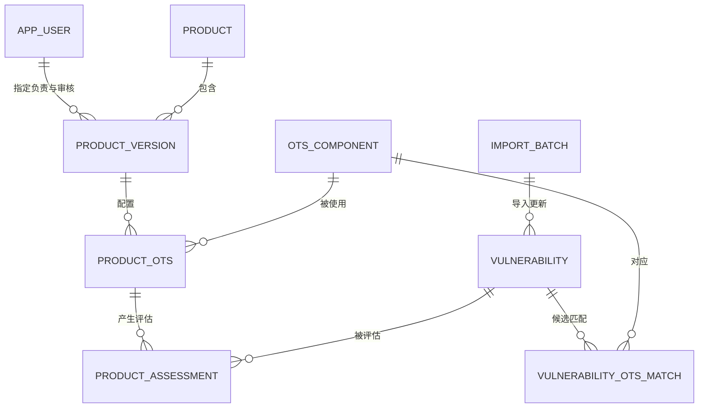
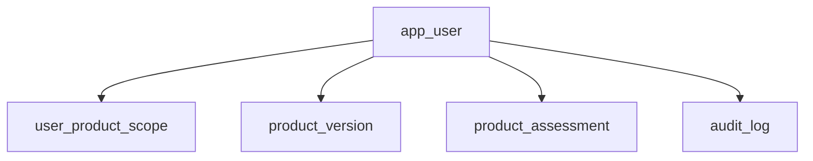

# OTS 信息维护平台数据表结构（11 表详细关系版）

- 文档版本：V1.0
- 对应需求：《OTS 信息维护平台需求规格说明》V1.6
- 对应方案：《OTS 信息维护平台系统方案》V1.6
- 数据库：MySQL 8.x，InnoDB，utf8mb4
- 基线日期：2026-08-15
- 应用基础表总数：11

本文件是完整数据表基线。以下 11 个编号章节分别对应一张 MySQL 基础表，全文不包含其他业务表定义。页面、待办、审核、评分、共享结果和导入错误均通过这 11 张表的字段或关联查询实现。

统一约定：

- 主键使用 `BIGINT UNSIGNED AUTO_INCREMENT`；
- 时间使用 `DATETIME(3)`，应用按 UTC 写入；
- `created_at` 默认 `CURRENT_TIMESTAMP(3)`；`updated_at` 默认 `CURRENT_TIMESTAMP(3)` 并在更新时自动刷新；
- 布尔值使用 `TINYINT(1)`，只允许 0 或 1；
- 状态使用 `VARCHAR(32)`，不使用 MySQL `ENUM`；状态合法性由服务端统一校验；
- CVSS 分数使用 `DECIMAL(3,1)`，只允许 0.0～10.0；
- 所有外键字段与被引用主键保持同为 `BIGINT UNSIGNED`；
- 业务主数据和已产生评估的数据默认禁止物理删除，停用通过状态字段实现；
- 外键默认使用 `ON UPDATE RESTRICT ON DELETE RESTRICT`，避免级联删除历史评估；
- 含 `row_version` 的可编辑记录默认从 1 开始，每次成功更新加 1，用于乐观锁；更新语句必须同时匹配主键和原版本号，受影响行数为 0 时提示用户刷新后重试。

本版核查结论：

| 核查项 | 结论 |
| --- | --- |
| 表 1 乐观锁 | 不是数据库运行的必备字段，但实现成本低，可防止两个管理员同时修改同一用户时互相覆盖角色或停用状态，因此保留。 |
| 表 1 `status` | 用于账号停用而不删除历史记录；精简为 `active`、`disabled`，不实现未提出需求的自动锁定状态。 |
| 产品版本人员分配 | 表 4 保存必填的 `owner_id` 和 `reviewer_id`，一个具体产品版本分别指定一个当前产品负责人和当前审核人。 |
| 删除 OTS 情报分析员 | 表 1 删除 `intel_analyst` 固定角色；表 5 删除 `assigned_analyst_id`、外键和索引，OTS 只保留四项核心业务信息。 |
| CVE 与 OTS 关联 | 表 8 不增加单一 OTS ID。一个 CVE 可影响多个 OTS，一个 OTS 也可对应多个 CVE，多对多关联由表 9 保存。 |
| AI 建议 | 表 8 增加 `ai_analysis_suggestion`，仅保存通用辅助建议，不作为来源事实或正式结论。 |
| 表 9 候选匹配 | 表名由 `vulnerability_ots_analysis` 调整为 `vulnerability_ots_match`，仅保存外部数据服务输入的 OTS/CVE 候选匹配、依据和来源批次，不再保存人工分析状态、分析内容或提交人。 |
| 表 10 人员字段 | 删除重复的 `author_id`。`owner_id` 表示当前责任人，`submitted_by` 表示实际执行提交动作的人。 |
| 表 11 审计范围 | 删除 `client_ip` 和恒定成功的 `result`，只记录已提交成功的数据库新增、更新、删除和批量写入。 |
| 导入后直接评估 | 导入表 9 候选匹配后，系统按表 6 为相关产品版本直接创建表 10 待评估任务，并从表 4 取得 `owner_id`；不新增通知表，工作台按责任人和状态查询。 |
| 跨产品评估参考 | 保留表 10 的跨产品查询；只展示相同 OTS/CVE 在其他产品中当前且已审核通过的摘要，不展示草稿、内部证据或审核意见。 |
| 管理平台生成采集范围 | 不新增表或字段。范围由表 3、4、6、5 实时查询；表 7 现有 `manifest_json` 保存范围快照，`scope_coverage_json` 保存逐 OTS 状态和覆盖截止时间。 |

## 1. `app_user`

保存本地用户及其固定角色。

| 字段 | 类型 | 必填 | 说明 |
| --- | --- | :---: | --- |
| `id` | BIGINT UNSIGNED | 是 | 主键 |
| `login_name` | VARCHAR(64) | 是 | 登录名 |
| `display_name` | VARCHAR(100) | 是 | 显示名称 |
| `password_hash` | VARCHAR(255) | 是 | 加盐密码摘要 |
| `roles_json` | JSON | 是 | 固定角色数组：管理员、产品负责人、审核人 |
| `status` | VARCHAR(32) | 是 | `active`：允许登录；`disabled`：禁止登录但保留历史记录 |
| `last_login_at` | DATETIME(3) | 否 | 最近登录时间 |
| `row_version` | INT UNSIGNED | 是 | 乐观锁版本号 |
| `created_at` | DATETIME(3) | 是 | 创建时间 |
| `updated_at` | DATETIME(3) | 是 | 更新时间 |

约束与索引：

- 主键：`pk_app_user(id)`；
- 唯一键：`uk_app_user_login(login_name)`；
- 普通索引：`idx_app_user_status(status)`；
- `status` 只允许 `active`、`disabled`；不需要自动登录锁定时，不设置 `locked` 状态；
- `roles_json` 必须是 JSON 数组，元素只允许 `admin`、`product_owner`、`reviewer`；
- 更新用户角色或状态时使用 `row_version` 做并发校验，避免后提交的页面静默覆盖先提交的修改；
- 用户停用后不得登录，但其授权、评估、审核和操作记录仍保留；
- 被第 2、4、6、7、10、11 张表引用，不允许物理删除已参与业务的用户。

## 2. `user_product_scope`

保存用户可访问的产品或产品版本范围。

| 字段 | 类型 | 必填 | 说明 |
| --- | --- | :---: | --- |
| `id` | BIGINT UNSIGNED | 是 | 主键 |
| `user_id` | BIGINT UNSIGNED | 是 | 用户 ID |
| `scope_type` | VARCHAR(16) | 是 | `product` 或 `version` |
| `product_id` | BIGINT UNSIGNED | 是 | 产品 ID |
| `product_version_id` | BIGINT UNSIGNED | 否 | 版本级授权时填写 |
| `scope_key` | VARCHAR(64) | 是 | 应用生成的授权唯一键 |
| `created_by` | BIGINT UNSIGNED | 是 | 授权人 ID |
| `created_at` | DATETIME(3) | 是 | 创建时间 |
| `updated_at` | DATETIME(3) | 是 | 更新时间 |

约束与索引：

- 主键：`pk_user_product_scope(id)`；
- 外键：`user_id` → 第 1 张表 `id`；
- 外键：`product_id` → 第 3 张表 `id`；
- 外键：`product_version_id` → 第 4 张表 `id`；
- 唯一键：`uk_user_product_scope(user_id, scope_key)`；
- 普通索引：`idx_scope_product(product_id, user_id)`、`idx_scope_version(product_version_id, user_id)`；
- 当 `scope_type=product` 时，`product_version_id` 必须为空；当 `scope_type=version` 时必须填写且必须属于 `product_id` 指定的产品；
- 本表只保存授权范围，不保存角色，角色统一由第 1 张表维护。

## 3. `product`

保存产品主数据。

| 字段 | 类型 | 必填 | 说明 |
| --- | --- | :---: | --- |
| `id` | BIGINT UNSIGNED | 是 | 主键 |
| `product_code` | VARCHAR(64) | 是 | 产品编号 |
| `product_name` | VARCHAR(200) | 是 | 产品名称 |
| `description` | TEXT | 否 | 产品说明 |
| `status` | VARCHAR(32) | 是 | `active`、`disabled` |
| `row_version` | INT UNSIGNED | 是 | 乐观锁版本号 |
| `created_at` | DATETIME(3) | 是 | 创建时间 |
| `updated_at` | DATETIME(3) | 是 | 更新时间 |

约束与索引：

- 主键：`pk_product(id)`；
- 唯一键：`uk_product_code(product_code)`；
- 普通索引：`idx_product_name(product_name)`、`idx_product_status(status)`；
- 一个产品可包含多个产品版本，并可被多个用户授权；
- 产品已有版本、授权或评估数据时禁止物理删除，只能改为 `disabled`。

## 4. `product_version`

保存产品版本、默认 CVSS 评估版本，以及该具体版本的当前产品负责人和当前审核人。

| 字段 | 类型 | 必填 | 说明 |
| --- | --- | :---: | --- |
| `id` | BIGINT UNSIGNED | 是 | 主键 |
| `product_id` | BIGINT UNSIGNED | 是 | 所属产品 ID |
| `version_no` | VARCHAR(100) | 是 | 产品版本号 |
| `description` | TEXT | 否 | 版本说明 |
| `primary_cvss_version` | VARCHAR(8) | 是 | 预留字段，允许 `3.1` 或 `4.0`；V1 应用只使用 `3.1` |
| `owner_id` | BIGINT UNSIGNED | 是 | 该产品版本当前指定产品负责人 ID |
| `reviewer_id` | BIGINT UNSIGNED | 是 | 该产品版本当前指定审核人 ID |
| `status` | VARCHAR(32) | 是 | `active`、`disabled` |
| `row_version` | INT UNSIGNED | 是 | 乐观锁版本号 |
| `created_at` | DATETIME(3) | 是 | 创建时间 |
| `updated_at` | DATETIME(3) | 是 | 更新时间 |

约束与索引：

- 主键：`pk_product_version(id)`；
- 外键：`product_id` → 第 3 张表 `id`；
- 外键：`owner_id` → 第 1 张表 `id`；
- 外键：`reviewer_id` → 第 1 张表 `id`；
- 唯一键：`uk_product_version(product_id, version_no)`；
- 普通索引：`idx_product_version_status(product_id, status)`、`idx_product_version_owner(owner_id, status)`、`idx_product_version_reviewer(reviewer_id, status)`；
- `primary_cvss_version` 只允许 `3.1` 或 `4.0`；V1 应用固定使用 `3.1`，保留 `4.0` 仅为后续演进预留；
- `owner_id` 指向的用户必须处于 `active` 状态并具有 `product_owner` 角色；
- `reviewer_id` 指向的用户必须处于 `active` 状态并具有 `reviewer` 角色；
- 表 9 导入新候选匹配后，表 10 新任务的 `owner_id` 取本表当前 `owner_id`；更换负责人时，未提交和已退回的当前任务同步转交，新任务使用新负责人，已提交或已完成修订不改写；
- 表 10 进入待审核后，仅该产品版本当前指定的审核人可以通过或退回；若指定审核人与提交人相同，必须先重新指定审核人，不能绕过禁止自审规则；
- 更换指定审核人只改变当前及后续待审核任务的归属，不修改表 10 已完成记录中的实际审核人；
- 一个产品版本可通过第 6 张表关联多个 OTS；
- 已关联 OTS、已有授权或评估数据的版本禁止物理删除，只能停用。

## 5. `ots_component`

OTS 的核心业务信息只包含名称、版本、官方网站和是否 EOL，不保存情报分析员或其他人员分配字段。

| 字段 | 类型 | 必填 | 说明 |
| --- | --- | :---: | --- |
| `id` | BIGINT UNSIGNED | 是 | 主键 |
| `ots_name` | VARCHAR(200) | 是 | OTS 名称 |
| `ots_version` | VARCHAR(200) | 是 | OTS 版本 |
| `official_website` | VARCHAR(1000) | 是 | 官方网站 |
| `is_eol` | TINYINT(1) | 是 | 是否 EOL |
| `row_version` | INT UNSIGNED | 是 | 乐观锁版本号 |
| `created_at` | DATETIME(3) | 是 | 创建时间 |
| `updated_at` | DATETIME(3) | 是 | 更新时间 |

约束与索引：

- 主键：`pk_ots_component(id)`；
- 唯一键：`uk_ots_name_version(ots_name, ots_version)`；
- 普通索引：`idx_ots_name(ots_name)`、`idx_ots_eol(is_eol)`；
- 名称和版本比较时去除首尾空格；是否区分大小写由建库排序规则统一决定；
- 一个 OTS 可关联多个产品版本，也可通过表 9 关联多个 CVE 候选匹配；
- 已被产品或漏洞候选匹配引用时禁止物理删除。

## 6. `product_ots`

保存产品版本与 OTS 的关联，不保存额外使用上下文。

| 字段 | 类型 | 必填 | 说明 |
| --- | --- | :---: | --- |
| `id` | BIGINT UNSIGNED | 是 | 主键 |
| `product_version_id` | BIGINT UNSIGNED | 是 | 产品版本 ID |
| `ots_component_id` | BIGINT UNSIGNED | 是 | OTS ID |
| `created_by` | BIGINT UNSIGNED | 是 | 关联创建人 ID |
| `created_at` | DATETIME(3) | 是 | 创建时间 |
| `updated_at` | DATETIME(3) | 是 | 更新时间 |

约束与索引：

- 主键：`pk_product_ots(id)`；
- 外键：`product_version_id` → 第 4 张表 `id`；
- 外键：`ots_component_id` → 第 5 张表 `id`；
- 外键：`created_by` → 第 1 张表 `id`；
- 唯一键：`uk_product_version_ots(product_version_id, ots_component_id)`；
- 普通索引：`idx_product_ots_component(ots_component_id, product_version_id)`；
- 本表是产品版本与 OTS 的多对多关联桥梁；
- 已生成产品评估后不得直接删除关联，应先完成影响确认并保留历史记录。

## 7. `import_batch`

保存离线数据包、实际使用的 OTS 采集范围快照、逐 OTS 覆盖结果、导入状态、统计和错误摘要。

| 字段 | 类型 | 必填 | 说明 |
| --- | --- | :---: | --- |
| `id` | BIGINT UNSIGNED | 是 | 主键 |
| `batch_no` | VARCHAR(100) | 是 | 批次号 |
| `format_version` | VARCHAR(32) | 是 | 数据包格式版本 |
| `package_file_name` | VARCHAR(255) | 是 | ZIP 文件名 |
| `package_sha256` | CHAR(64) | 是 | 整包摘要 |
| `archive_path` | VARCHAR(1000) | 否 | 原始包归档位置 |
| `covered_from` | DATETIME(3) | 否 | 本批次成功 OTS 的整体最早覆盖开始时间 |
| `covered_to` | DATETIME(3) | 否 | 本批次成功 OTS 的整体最晚覆盖截止时间；不能替代逐 OTS 覆盖信息 |
| `status` | VARCHAR(32) | 是 | `uploaded`、`validated`、`importing`、`succeeded`、`failed` |
| `result_json` | JSON | 否 | 新增、更新、重复、冲突统计 |
| `error_json` | JSON | 否 | 文件、行号、字段和错误原因摘要 |
| `scope_coverage_json` | JSON | 否 | 逐 OTS 采集结果：OTS ID、`succeeded/failed/not_run`、覆盖起止时间和错误摘要 |
| `manifest_json` | JSON | 否 | 数据包说明、`scope_export_id`、范围文件 SHA-256、实际范围快照及各文件摘要 |
| `imported_by` | BIGINT UNSIGNED | 是 | 导入人 ID |
| `started_at` | DATETIME(3) | 否 | 开始时间 |
| `finished_at` | DATETIME(3) | 否 | 结束时间 |
| `created_at` | DATETIME(3) | 是 | 创建时间 |
| `updated_at` | DATETIME(3) | 是 | 更新时间 |

约束与索引：

- 主键：`pk_import_batch(id)`；
- 外键：`imported_by` → 第 1 张表 `id`；
- 唯一键：`uk_import_batch_no(batch_no)`、`uk_import_package_sha(package_sha256)`；
- 普通索引：`idx_import_status_time(status, created_at)`、`idx_import_covered_to(covered_to)`；
- 同一批次号或相同文件摘要不得重复导入；
- 批次 `status=succeeded` 表示数据包已成功校验并提交数据库，不表示范围内每个 OTS 都采集成功；逐 OTS 成败必须以 `scope_coverage_json` 为准；
- 批次完成校验后 `manifest_json` 必须存在，批次结束后 `scope_coverage_json` 必须存在；
- `manifest_json` 中的范围快照至少保存 OTS ID、名称、版本、官方网站和导出时的上次覆盖截止时间；
- `scope_coverage_json` 中只有 `succeeded` 的 OTS 可以写入新的成功覆盖截止时间，`failed` 和 `not_run` 必须保留错误或原因且不得推进覆盖；
- 下一次导出某 OTS 时，从最近成功导入批次中取得该 OTS 最后的成功覆盖截止时间；从未成功采集时使用应用配置的初始回溯起点；
- 在最多 200 个 OTS 的 V1 规模下，范围快照和逐 OTS 覆盖信息保存在 JSON 中即可，不新增采集范围表或覆盖状态表；
- 导入统计和错误明细摘要全部保存在 JSON 字段中，不拆分新的错误表；
- 被第 8 张表引用的批次禁止删除，原始 ZIP 文件按归档策略保留。

## 8. `vulnerability`

每个 CVE 保存一行当前来源事实，CVSS、CWE、受影响范围、引用和 KEV 合并保存。CVE 与 OTS 是多对多关系，因此本表不直接保存单一 OTS ID，具体关联由第 9 张表表示。

| 字段 | 类型 | 必填 | 说明 |
| --- | --- | :---: | --- |
| `id` | BIGINT UNSIGNED | 是 | 主键 |
| `cve_id` | VARCHAR(32) | 是 | CVE ID |
| `source_status` | VARCHAR(32) | 是 | 来源当前状态 |
| `description` | TEXT | 否 | NVD/CNA 等来源提供的原始漏洞描述 |
| `ai_analysis_suggestion` | TEXT | 否 | AI 基于公开漏洞事实生成的通用辅助建议；可为空，不作为来源事实或产品结论 |
| `published_at` | DATETIME(3) | 否 | 发布时间 |
| `source_modified_at` | DATETIME(3) | 否 | 来源最后修改时间 |
| `cwe_json` | JSON | 否 | CWE（通用弱点枚举）数组，通常来自 NVD `weaknesses` 数据，保存 CWE ID、说明及来源 |
| `affected_ranges_json` | JSON | 否 | 受影响范围 |
| `references_json` | JSON | 否 | 参考链接数组 |
| `cvss31_score` | DECIMAL(3,1) | 否 | CVSS v3.1 基础分 |
| `cvss31_severity` | VARCHAR(16) | 否 | CVSS v3.1 严重度 |
| `cvss31_vector` | VARCHAR(500) | 否 | CVSS v3.1 向量 |
| `cvss31_source` | VARCHAR(200) | 否 | CVSS v3.1 评分来源 |
| `cvss40_score` | DECIMAL(3,1) | 否 | 预留的 CVSS v4.0 基础分；V1 不导入或使用 |
| `cvss40_severity` | VARCHAR(16) | 否 | 预留的 CVSS v4.0 严重度；V1 不导入或使用 |
| `cvss40_vector` | VARCHAR(1000) | 否 | 预留的 CVSS v4.0 向量；V1 不导入或使用 |
| `cvss40_source` | VARCHAR(200) | 否 | 预留的 CVSS v4.0 评分来源；V1 不导入或使用 |
| `is_kev` | TINYINT(1) | 是 | 是否为 KEV |
| `kev_date_added` | DATE | 否 | KEV 加入日期 |
| `kev_due_date` | DATE | 否 | KEV 要求处置日期 |
| `kev_required_action` | TEXT | 否 | KEV 官方处置说明 |
| `import_batch_id` | BIGINT UNSIGNED | 是 | 最近更新批次 ID |
| `content_sha256` | CHAR(64) | 是 | 规范化来源字段计算出的 SHA-256 内容哈希，用于去重和识别来源实质变化 |
| `created_at` | DATETIME(3) | 是 | 创建时间 |
| `updated_at` | DATETIME(3) | 是 | 更新时间 |

约束与索引：

- 主键：`pk_vulnerability(id)`；
- 外键：`import_batch_id` → 第 7 张表 `id`；
- 唯一键：`uk_vulnerability_cve(cve_id)`；
- 普通索引：`idx_vulnerability_modified(source_modified_at)`、`idx_vulnerability_kev(is_kev, published_at)`、`idx_vulnerability_cvss31(cvss31_score)`、`idx_vulnerability_cvss40(cvss40_score)`；
- `cve_id` 按 `CVE-YYYY-NNNN...` 形式校验并统一转为大写；
- `content_sha256` 是机器比较用哈希值，不是供用户阅读的文字摘要；哈希计算不包含人工字段或 `ai_analysis_suggestion`；
- `ai_analysis_suggestion` 只能作为产品负责人的辅助参考，页面必须与来源描述、候选匹配和产品结论明确区分；
- JSON 字段保存来源的一对多结构，不再拆分 CWE、引用或受影响范围表；
- 每个 CVE 只保存一行当前事实，来源更新时更新该行及相关候选匹配，但不得覆盖第 10 张表中的产品评估结论；
- 被 OTS/CVE 候选匹配或产品评估引用后禁止物理删除，来源状态变化使用 `source_status` 表示。

## 9. `vulnerability_ots_match`

一行对应一个“OTS + CVE”候选关系，保存外部数据服务输入的匹配方式、依据、可选置信度和来源批次。该表由数据导入维护，不设置人工情报分析流程。

| 字段 | 类型 | 必填 | 说明 |
| --- | --- | :---: | --- |
| `id` | BIGINT UNSIGNED | 是 | 主键 |
| `vulnerability_id` | BIGINT UNSIGNED | 是 | CVE ID |
| `ots_component_id` | BIGINT UNSIGNED | 是 | OTS ID |
| `match_method` | VARCHAR(32) | 是 | 匹配方式：`cpe`、`purl`、`name_version`、`vendor_advisory` 或 `combined` |
| `match_basis` | TEXT | 是 | CVE 与 OTS 的候选关联依据，例如 CPE/purl、项目或厂商名称、受影响版本范围、官方公告或参考链接 |
| `match_confidence` | DECIMAL(5,4) | 否 | 外部工具给出的可选置信度，范围 0.0000～1.0000；只用于排序，不代表产品受影响概率 |
| `match_evidence_json` | JSON | 否 | 结构化匹配证据，例如命中的 CPE、版本表达式、公告链接和规则版本 |
| `first_seen_batch_id` | BIGINT UNSIGNED | 是 | 首次发现该候选关系的导入批次 ID |
| `last_seen_batch_id` | BIGINT UNSIGNED | 是 | 最近更新或再次发现该候选关系的导入批次 ID |
| `based_on_source_modified_at` | DATETIME(3) | 否 | 匹配所依据的漏洞来源修改时间 |
| `match_content_sha256` | CHAR(64) | 是 | 规范化匹配字段计算出的内容哈希，用于识别匹配依据实质变化 |
| `created_at` | DATETIME(3) | 是 | 创建时间 |
| `updated_at` | DATETIME(3) | 是 | 更新时间 |

约束与索引：

- 主键：`pk_vulnerability_ots_match(id)`；
- 外键：`vulnerability_id` → 第 8 张表 `id`；
- 外键：`ots_component_id` → 第 5 张表 `id`；
- 外键：`first_seen_batch_id`、`last_seen_batch_id` → 第 7 张表 `id`；
- 唯一键：`uk_vulnerability_ots(vulnerability_id, ots_component_id)`；
- 普通索引：`idx_match_ots(ots_component_id, vulnerability_id)`、`idx_match_last_batch(last_seen_batch_id, updated_at)`；
- 表 10 通过 OTS ID 和 CVE ID 精确读取时使用唯一键 `uk_vulnerability_ots`，无需增加表 10 到表 9 的重复外键；
- 一行只能表示一个“OTS + CVE”，不同 CVE 分别保存候选关系；
- 本表记录只代表外部工具发现候选关联，不表示任何具体产品受影响；产品适用性结论只能写入第 10 张表；
- `match_method` 和 `match_basis` 必填；`match_confidence` 为空时页面显示“未提供”，不得自行推断；
- CWE、CVSS、KEV、受影响范围和来源描述不在本表重复保存，页面通过 `vulnerability_id` 读取第 8 张表；
- 本表无人工草稿、提交人或审核状态，数据包导入通过唯一键进行幂等新增或更新；
- `match_content_sha256` 变化视为候选匹配依据实质变化，应触发相关产品评估待复评，但不得覆盖表 10 已有结论。

## 10. `product_assessment`

一行代表一个产品评估修订，合并保存待办状态、产品分析、环境评分和审核结果。评估页面同时读取第 8 张表的漏洞来源事实、第 9 张表相同“OTS + CVE”的候选匹配依据，以及表 10 中其他产品当前且已审核通过的评估摘要。

| 字段 | 类型 | 必填 | 说明 |
| --- | --- | :---: | --- |
| `id` | BIGINT UNSIGNED | 是 | 主键 |
| `product_ots_id` | BIGINT UNSIGNED | 是 | 产品 OTS 关联 ID |
| `vulnerability_id` | BIGINT UNSIGNED | 是 | CVE ID |
| `revision_no` | INT UNSIGNED | 是 | 修订号 |
| `parent_revision_id` | BIGINT UNSIGNED | 否 | 上一修订 ID |
| `is_current` | TINYINT(1) | 是 | 是否当前修订 |
| `status` | VARCHAR(32) | 是 | `pending`、`submitted`、`returned`、`completed`、`reassess` |
| `owner_id` | BIGINT UNSIGNED | 是 | 当前任务责任人 ID；创建任务时取第 4 张表当前产品负责人 |
| `analysis_summary` | TEXT | 否 | 产品负责人对该产品 OTS/CVE 的分析摘要 |
| `trigger_conditions` | TEXT | 否 | 结合本产品上下文识别的漏洞触发条件 |
| `affected_functions` | TEXT | 否 | 本产品涉及的功能、模块或接口 |
| `applicability` | VARCHAR(32) | 是 | `affected`、`not_affected`、`partly_affected`、`pending` |
| `applicability_basis` | TEXT | 否 | 适用性判断依据 |
| `product_impact` | TEXT | 否 | 产品影响 |
| `existing_controls` | TEXT | 否 | 现有控制 |
| `treatment` | VARCHAR(32) | 否 | 处置方式 |
| `treatment_detail` | TEXT | 否 | 处置说明 |
| `evidence_text` | TEXT | 否 | 证据说明或内网引用位置 |
| `cvss_version` | VARCHAR(8) | 否 | 预留字段，允许 `3.1` 或 `4.0`；V1 评估固定写入 `3.1` |
| `environmental_score` | DECIMAL(3,1) | 否 | 产品环境分数 |
| `environmental_vector` | VARCHAR(1000) | 否 | 产品环境向量 |
| `cvss_metrics_json` | JSON | 否 | 产品环境指标 |
| `calculator_version` | VARCHAR(64) | 否 | 评分计算器版本 |
| `based_on_source_modified_at` | DATETIME(3) | 是 | 评估依据的来源时间 |
| `submitted_by` | BIGINT UNSIGNED | 否 | 实际执行提交动作的用户 ID；草稿阶段为空 |
| `submitted_at` | DATETIME(3) | 否 | 提交时间 |
| `review_decision` | VARCHAR(16) | 否 | `approved` 或 `returned` |
| `review_comment` | TEXT | 否 | 审核意见 |
| `reviewer_id` | BIGINT UNSIGNED | 否 | 审核人 ID |
| `reviewed_at` | DATETIME(3) | 否 | 审核时间 |
| `reassess_reason` | VARCHAR(500) | 否 | 待复评原因 |
| `row_version` | INT UNSIGNED | 是 | 乐观锁版本号 |
| `created_at` | DATETIME(3) | 是 | 创建时间 |
| `updated_at` | DATETIME(3) | 是 | 更新时间 |

约束与索引：

- 主键：`pk_product_assessment(id)`；
- 外键：`product_ots_id` → 第 6 张表 `id`；
- 外键：`vulnerability_id` → 第 8 张表 `id`；
- 自关联外键：`parent_revision_id` → 本表 `id`；
- 外键：`owner_id`、`submitted_by`、`reviewer_id` → 第 1 张表 `id`；
- 唯一键：`uk_assessment_revision(product_ots_id, vulnerability_id, revision_no)`；
- 普通索引：`idx_assessment_current_owner(is_current, owner_id, status, updated_at)`、`idx_assessment_current_review(is_current, status, updated_at)`、`idx_assessment_cross_product(vulnerability_id, is_current, status, product_ots_id)`；
- 服务端保证同一“产品 OTS + CVE”只有一个 `is_current=1` 的修订；新旧当前修订切换必须在同一事务完成；
- 不单独保存“填写人”：`owner_id` 表示当前责任人，`submitted_by` 记录不可替代的提交事件操作者；草稿编辑过程由第 11 张表的数据更新记录追溯；
- 新建任务的 `owner_id` 必须等于第 4 张表为该产品版本指定的当前负责人；负责人调整时可转交未提交或已退回的当前任务，已提交和已完成修订不改写；
- 审核人必须是第 4 张表为该产品版本指定的当前审核人，且不得等于提交人；实际审核完成时将其写入 `reviewer_id`；
- 退回、复评或修改已完成结论时必须新增修订；
- 产品评估通过 `product_ots_id` → 第 6 张表取得 `ots_component_id`，再使用 `(ots_component_id, vulnerability_id)` 唯一定位第 9 张表的候选匹配，无需增加可产生不一致的重复外键；
- 产品负责人必须能查看第 8 张表的来源事实和 AI 通用建议，以及第 9 张表的匹配方式、匹配依据和可选置信度；这些信息不能自动形成表 10 结论；
- 其他产品只能读取已审核通过的当前修订摘要，不能读取草稿、证据、审核意见或可编辑字段。

跨产品展示直接按相同 OTS 和 CVE 查询本表：当前产品显示当前修订状态；其他产品只显示 `is_current=1`、`status=completed` 且 `review_decision=approved` 的产品名称、产品版本、适用性、分析摘要、环境分数、处置方式和审核完成时间。

## 11. `audit_log`

保存核心业务表已成功提交的数据库变更。纯查询、登录、导出、备份执行和失败后回滚的操作不写入本表；如需登录安全追踪，使用独立应用安全日志。

| 字段 | 类型 | 必填 | 说明 |
| --- | --- | :---: | --- |
| `id` | BIGINT UNSIGNED | 是 | 主键 |
| `user_id` | BIGINT UNSIGNED | 否 | 操作者 ID；系统任务可为空 |
| `action` | VARCHAR(16) | 是 | `insert`、`update`、`delete`、`batch_upsert` |
| `object_type` | VARCHAR(64) | 是 | 操作对象类型 |
| `object_id` | VARCHAR(100) | 否 | 操作对象 ID |
| `detail_json` | JSON | 否 | 新增对象关键值、更新前后差异、删除原因，或批量写入的批次号和数量 |
| `created_at` | DATETIME(3) | 是 | 操作时间 |

约束与索引：

- 主键：`pk_audit_log(id)`；
- 外键：`user_id` → 第 1 张表 `id`，系统任务允许为空；
- 普通索引：`idx_audit_time(created_at)`、`idx_audit_user_time(user_id, created_at)`、`idx_audit_object(object_type, object_id, created_at)`；
- `action` 只允许 `insert`、`update`、`delete`、`batch_upsert`；提交、审核、退回、分配人员等业务动作统一表现为对应数据行的 `insert` 或 `update`，具体字段变化写入 `detail_json`；
- 只记录事务最终提交成功的数据变化，审计记录应与业务修改处于同一事务；
- 操作记录由系统追加写入，普通用户不得修改或删除；
- `client_ip` 对本平台的数据变更追溯不是必需字段，本版删除；若后续有登录风控或安全事件定位要求，再在安全日志方案中记录来源地址；
- 数据导入使用 `batch_upsert` 记录批次和汇总数量，不为每一条来源数据生成一条审计记录。

## 核心业务关系图

图中每个方框均对应前述 11 张基础表之一，不表示新增表。



## 用户、授权和操作关系图



其中，第 1 张表在第 4 张表中承担指定产品负责人和指定审核人角色；还通过创建人/导入人字段关联第 6、7 张表，并在第 10 张表中保留任务责任人、实际提交人和实际审核人。第 9 张表由导入流程维护，不直接引用用户。

## 完整关系说明

1. 第 1 张表与第 2 张表是“一对多”：一个用户可以获得多个产品或产品版本授权。
2. 第 3 张表与第 4 张表是“一对多”：一个产品可以有多个产品版本；第 1 张表与第 4 张表是“一对多”，一个产品负责人或审核人可负责多个具体产品版本，但每个产品版本各只有一个当前指定产品负责人和审核人。
3. 第 4 张表与第 5 张表是“多对多”，通过第 6 张表实现：一个产品版本可使用多个 OTS，同一 OTS 也可被多个产品版本使用；OTS 本身不分配情报分析员。
4. 第 7 张表与第 8 张表是“一对多”：一个导入批次可新增或更新多个 CVE；第 8 张表只指向最近更新批次。
5. 第 8 张表与第 5 张表是“多对多”，通过第 9 张表实现：一个 CVE 可关联多个 OTS，同一 OTS 也可关联多个 CVE；每个组合只保留一条当前候选匹配记录及其首次/最近来源批次。
6. 第 6 张表与第 8 张表是“多对多”，通过第 10 张表实现：一个产品 OTS 需要评估多个 CVE，同一 CVE 也会被多个产品 OTS 独立评估；表 10 再用第 6 张表中的 OTS ID 和自身的 CVE ID 唯一关联第 9 张表的候选匹配依据。
7. 第 10 张表对自身是“一对多修订链”：旧修订可产生一个或多个后续修订，但同一“产品 OTS + CVE”只能有一个当前修订。
8. 第 1 张表与第 10、11 张表均为“一对多”：一个用户可以负责或提交多条产品评估、完成多条审核并产生多条数据库变更记录。
9. 第 11 张表通过 `object_type + object_id` 记录各业务对象操作，不对所有对象设置数据库外键，避免一个字段同时引用多种对象造成约束歧义。

## 关键查询路径

### 生成外网采集范围

第 3 张表筛选 `status=active` 的产品 → 第 4 张表筛选 `status=active` 的产品版本 → 第 6 张表取得产品 OTS 关联 → 第 5 张表取得 OTS，并按第 5 张表 `id` 去重。同一 OTS 被多个产品版本使用时只导出一次；未关联启用产品版本的 OTS 不导出。

每个 OTS 的 `last_covered_time` 从第 7 张表最近成功批次的 `scope_coverage_json` 中读取最后一次 `succeeded` 覆盖截止时间；没有成功记录时由应用使用配置的初始回溯起点。现有索引 `idx_product_status`、`idx_product_version_status`、`uk_product_version_ots` 和 `idx_import_status_time` 已能支持该查询，不需要增加索引。

### 查询某产品版本的 OTS 清单

第 3 张表 → 第 4 张表 → 第 6 张表 → 第 5 张表。

### 查询某 OTS 的候选漏洞

第 5 张表 → 第 9 张表 → 第 8 张表，展示该 OTS 的 CVE、匹配方式、匹配依据、可选置信度、来源事实和最近来源批次。第 9 张表没有人工分析状态。

### 查询当前产品每个 CVE 的评估

第 6 张表 → 第 10 张表 → 第 8 张表，且第 10 张表取 `is_current=1`。评估详情还使用第 6 张表的 `ots_component_id` 和第 10 张表的 `vulnerability_id` 关联第 9 张表，展示候选匹配方式与依据。

### 查询产品负责人待办

第 1 张表 → 第 4 张表的 `owner_id` → 第 6 张表 → 第 10 张表，筛选第 10 张表 `is_current=1`、`owner_id` 为当前用户且 `status` 为 `pending`、`returned` 或 `reassess`。该查询结果即工作台站内通知，不新增通知表。

### 查询审核人待办

第 1 张表 → 第 4 张表的 `reviewer_id` → 第 6 张表 → 第 10 张表，筛选第 10 张表 `is_current=1` 且 `status=submitted`。第 10 张表中的 `reviewer_id` 是实际审核完成后的留痕，不用于分配待办。

### 查询同一 OTS 在其他产品的评估结果

由当前第 6 张表取得 `ots_component_id`，反查该 OTS 的其他第 6 张表记录，再关联第 10、8、4、3 张表。其他产品结果必须同时满足 `is_current=1`、`status=completed`、`review_decision=approved`，且只返回产品名称、产品版本、适用性、分析摘要、环境分数、处置方式和审核完成时间。

### 查询某 CVE 的完整追溯链

第 8 张表 → 第 7 张表查看最近来源批次；第 8 张表 → 第 9 张表查看各 OTS 候选匹配及来源批次；第 8 张表 → 第 10 张表查看各产品评估和修订；成功提交的数据库数据变化由第 11 张表查询。

## 关键事务规则

1. 采集范围导出：只读查询第 3、4、6、5、7 张表，生成范围导出 ID、CSV 和文件摘要；不修改数据库，因此不写第 11 张表。
2. 范围包导入：先校验第 7 张表 `manifest_json` 对应的范围快照和摘要；表 9 候选关联中的 OTS ID 必须属于该快照，每个表 8 CVE 至少有一条范围内表 9 候选关系；校验失败不得写入业务数据。
3. 覆盖时间推进：导入成功后在第 7 张表 `scope_coverage_json` 分别保存各 OTS 结果，只有 `succeeded` 推进覆盖截止时间，`failed/not_run` 保持原值。
4. 导入后生成评估待办：新增或更新第 8、9 张表后，按第 5、6、4 张表查找全部相关有效产品版本；缺少第 10 张表当前任务时创建 `status=pending` 的第 1 修订并写入第 4 张表 `owner_id`，已有完成结论且来源或匹配依据实质变化时创建 `status=reassess` 的新修订；所有写入在同一事务提交，提交后工作台按 `owner_id + status` 立即显示待办。
5. 产品评估提交：校验当前用户是任务 `owner_id` 且仍具有相应产品范围，读取第 8 张表来源事实和第 9 张表候选匹配依据，再校验分析摘要、适用性依据、环境指标和处置内容；服务端重算产品环境评分，确认第 4 张表指定审核人与提交人不同后，将第 10 张表状态改为待审核并冻结该修订。
6. 审核通过：校验当前用户是第 4 张表指定审核人且与提交人不同，将实际审核人、审核结论和时间写入第 10 张表，状态改为已完成。
7. 审核退回：保留被审核修订，新增下一修订并切换 `is_current`；新旧切换在同一事务完成。
8. 来源更新：先更新第 8 张表并按需更新第 9 张表的最近批次、匹配依据和内容哈希；发生实质变化时直接为相关第 10 张表生成待复评修订，不设置表 9 人工复核状态，不得覆盖已提交或已完成记录。
9. 删除控制：已被下游引用的数据禁止物理删除；用户、产品、产品版本通过状态停用，历史评估和操作记录始终保留。
10. 变更审计：核心业务数据的新增、更新、删除和批量写入必须在同一事务中追加第 11 张表；事务回滚时对应审计记录一并回滚。

## 建表验收

执行以下查询时结果必须为 `11`：

```sql
SELECT COUNT(*)
FROM information_schema.tables
WHERE table_schema = DATABASE()
  AND table_type = 'BASE TABLE';
```

应用升级使用编号化 MySQL SQL 脚本，不创建额外的迁移基础表。数据库基础表名称必须与本文件 1～11 节完全一致。
