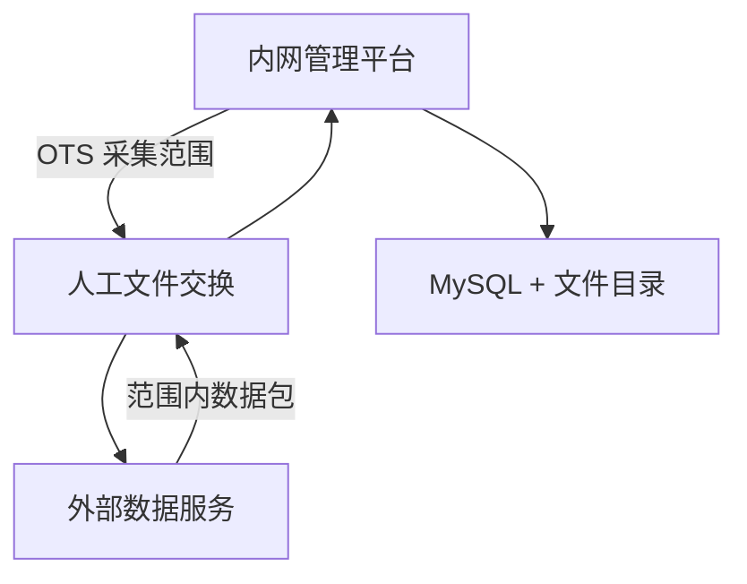
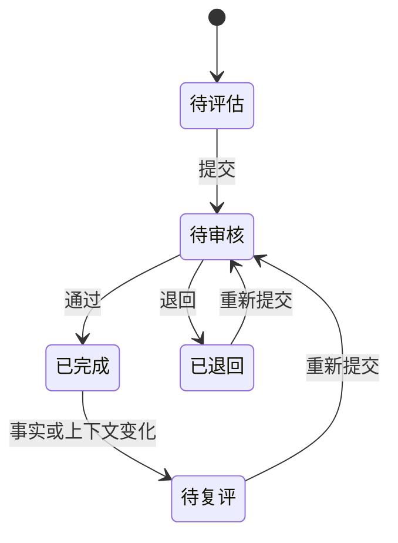
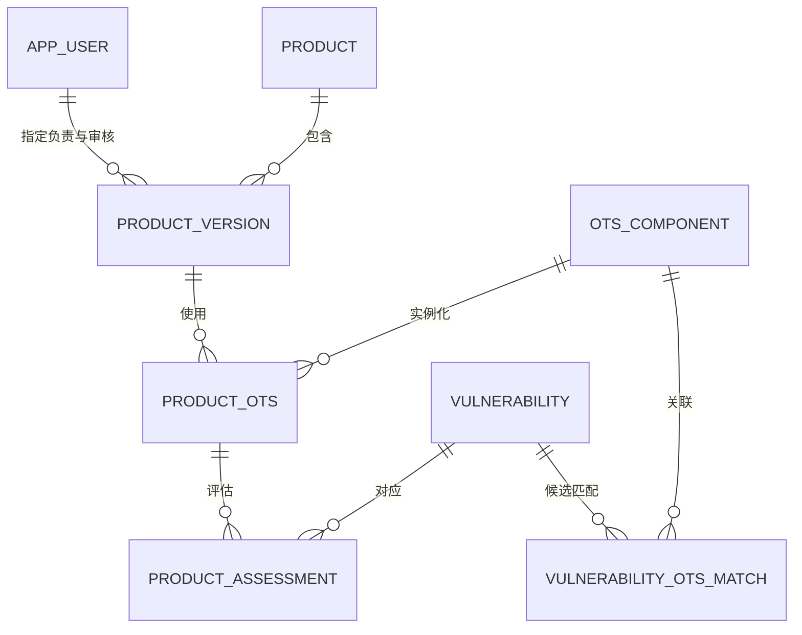

# OTS 信息维护平台系统方案

| 文档项 | 内容 |
| --- | --- |
| 文档版本 | V1.6 |
| 对应需求 | 《OTS 信息维护平台需求规格说明》V1.6 |
| 编制日期 | 2026-08-15 |
| 方案原则 | 功能简洁、路径清晰、单机部署、内外网离线交换 |
| 本版调整 | 删除 OTS 情报分析员和独立情报分析环节；导入成功后直接生成产品评估待办并站内通知产品负责人；保留其他产品已审核评估结论的参考能力；外网采集为项目边界外的外部数据服务；数据库升级使用编号化 MySQL SQL 脚本 |

## 1. 方案结论

V1 采用“外部数据服务 + 离线 ZIP/CSV 数据包 + 内网管理平台”的形式。

- 管理平台先根据实际在用 OTS 导出采集范围；外部数据服务可据此准备范围内数据包，但其采集、匹配和联网实现不属于本项目；
- 内网管理平台负责产品/OTS 主数据、数据导入、产品评估、审核、查询和导出；
- 两端不直接通信，用户通过文件完成数据交换；
- 管理平台采用单体应用和单节点 MySQL，不引入微服务、消息队列、缓存集群、对象存储或独立搜索引擎；
- V1 使用本地账号和固定角色，为每个产品版本指定产品负责人和审核人，安全只保留基础控制；
- 邮件、AI 和跨产品评估复制均不作为 V1 验收内容。

该方案满足 200 个产品、200 个 OTS、每个产品不超过 3 个版本、10～20 个并发用户和 10 年数据保留要求。

## 2. 总体架构

### 2.1 外部数据服务（项目边界外）

外部数据服务的职责由其独立项目或供应方定义。本项目只规定其输入/输出契约：

- 读取管理平台导出的采集范围 CSV；
- 生成符合第 3 章版本化 ZIP/CSV 契约的数据包；
- 只在数据包中提供与范围内 OTS 存在候选匹配关系的漏洞、KEV 和 EOL 候选；
- 按每个范围 OTS 提供 `succeeded`、`failed` 或 `not_run` 及覆盖时间。

外部数据服务不维护产品评估结论，不访问内网数据库，不直接向管理平台推送。本项目不实现其 NVD、CISA KEV、endoflife.date 联网访问、分页、限流、重试、匹配算法、采集游标或日志。

### 2.2 内网管理平台

职责：

- 管理本地用户、固定角色和产品范围授权；
- 管理产品、产品版本、OTS、产品版本与 OTS 的关联，以及产品版本负责人和审核人分配；
- 导出采集范围，校验并导入离线数据包；
- 管理 CVE、CVSS、CWE、KEV 和 EOL 数据；
- 支持导入后直接生成产品评估待办，以及评估、审核和修订；
- 提供工作台、查询、导出、数据库变更记录和备份状态。

管理平台不访问互联网，不保存外网数据源 API Key。

### 2.3 技术架构

| 层级 | V1 选型 | 说明 |
| --- | --- | --- |
| 前端 | Vue 3 + TypeScript + 管理端组件库 | 适合表格、表单和权限页面 |
| 后端 | Python FastAPI | 处理 ZIP/CSV 输入、业务规则和评分数据 |
| 数据访问 | SQLAlchemy + 编号化 MySQL SQL 脚本 | SQLAlchemy 提供关系映射和事务；数据库升级脚本独立于后端应用，且不创建额外迁移表 |
| 数据库 | MySQL 8.4 LTS，或组织已验证的 MySQL 8.x | 使用 InnoDB、`utf8mb4`，支持多人并发、事务、索引和长期备份 |
| 文件处理 | Python 标准 CSV/ZIP 库 | 不引入额外文件处理平台 |
| 后台任务 | 单个后台执行进程 + `import_batch` 状态 | 处理导入和导出，不新增任务表，不使用 Redis/RabbitMQ |
| 部署 | Docker Compose | 应用和 MySQL 两个主要服务 |

若组织已有统一 Java 或 .NET 技术栈，可替换应用实现语言，但离线交换、数据模型、状态和接口规则保持不变。

## 3. 离线数据交换方案

### 3.1 采集范围导出

管理平台从第 3、4、6、5 张表按“启用产品 → 启用产品版本 → 产品 OTS 关联 → OTS”生成范围。相同 OTS 被多个产品版本使用时只导出一次；未关联任何启用产品版本的 OTS 不进入默认范围。管理平台导出 `collector_scope.csv`，每行表示一个需要采集的 OTS，至少包含：

| 字段 | 说明 |
| --- | --- |
| scope_export_id | 本次范围导出标识，同一文件内固定 |
| ots_id | 内网 OTS 标识 |
| ots_name | OTS 名称 |
| ots_version | OTS 版本 |
| official_website | OTS 官方网站，用于辅助项目识别 |
| last_covered_time | 上次数据覆盖截止时间 |

`last_covered_time` 从最近成功导入批次的 `scope_coverage_json` 中按 OTS 取得；从未成功采集的 OTS 为空，由外网工具使用配置的初始回溯起点。采集范围不包含产品名称、产品用途、网络配置、评估结论或内部证据。

范围变化规则：

- 新增产品 OTS 关联后，下一次导出自动包含该 OTS；
- 同一 OTS 新增更多产品关联时仍只导出一次；
- 产品或产品版本停用、最后一个有效关联移除后，下一次导出不再包含该 OTS；
- OTS 移出范围只停止后续采集，不删除历史漏洞、候选关联或产品评估；
- 导出是只读操作，不写入第 11 张表数据库变更记录。

### 3.2 外部输入数据约束

本项目不处理外部数据服务如何获取数据源。为保证导入安全和业务正确性，外部服务生成回传包前必须与 `collector_scope.csv` 做匹配和过滤；只有与至少一个范围内 OTS 形成候选匹配的 CVE 才能进入数据包。

#### NVD

- 外部服务提供 CVE ID、状态、发布时间、最后修改时间、描述、CWE、受影响范围、参考链接及来源 CVSS；
- 名称、版本和官方网站只能生成候选匹配，不能自动形成产品受影响结论；匹配方式、依据和可选置信度写入 `matches.csv`，导入后供各产品负责人评估时参考。

#### CISA KEV

- 外部服务仅提供已经与范围内 OTS 形成候选匹配的 KEV 记录；
- KEV 记录包含加入日期、要求处置日期、勒索活动标记和官方处置说明；
- KEV 新增或内容变化在导入后触发相关记录待复核。

#### EOL

- 外部服务按 OTS 名称和版本提供可用的生命周期候选信息；
- 导入结果只作为候选信息；
- 审核人确认后才更新 OTS 的 `is_eol` 当前结论；
- 有供应商或项目官方来源时，人工补充并优先采用官方来源；
- 无可靠信息时不更新当前结论，也不推断为“未 EOL”。

外部数据包为每个范围 OTS 输出 `succeeded`、`failed` 或 `not_run`，并仅为 `succeeded` 输出新的覆盖截止时间。成功完成但没有新增匹配只表示该覆盖窗口内没有新的匹配候选，不表示该 OTS 没有漏洞。

### 3.3 ZIP 数据包

数据包命名为 `ots_intelligence_YYYYMMDD_HHMMSS.zip`，包含：

| 文件 | 内容 |
| --- | --- |
| collector_scope.csv | 本批次实际使用的原始采集范围快照 |
| manifest.csv | 包格式版本、批次号、生成时间、外部数据服务版本、范围导出 ID、范围文件摘要、各文件摘要和逐 OTS 采集结果 |
| vulnerabilities.csv | CVE 基础事实及来源时间 |
| affected_ranges.csv | CVE、CPE 和受影响版本范围 |
| cvss_scores.csv | 来源提供的 CVSS v3.1 分数、向量和严重度 |
| cwes.csv | CVE 与 CWE 关联 |
| references.csv | CVE 参考链接及标签 |
| kev.csv | CISA KEV 信息 |
| lifecycle.csv | OTS 版本线的 EOL 候选信息 |
| matches.csv | CVE 与范围内 OTS 的候选匹配及匹配依据 |

所有 CSV 使用 UTF-8、固定表头、ISO 8601 时间和稳定主键。包格式设置独立版本号；管理平台只接受兼容版本。`vulnerabilities.csv` 中的每个 CVE 必须至少在 `matches.csv` 中关联一个范围内 OTS；CVE 的评分、CWE、引用、KEV 和受影响范围文件只能引用这些 CVE。

### 3.4 导入处理

导入页面固定为四步：

1. 上传数据包；
2. 校验格式、字段、引用关系、摘要、批次号和采集范围；
3. 预览新增、更新、重复、冲突和错误数量；
4. 管理员确认后导入并查看结果。

导入规则：

- `batch_no` 相同的包重复上传时直接提示已导入，不重复生成任务；
- 校验 `collector_scope.csv` 摘要、`scope_export_id` 和 `manifest.csv` 一致；
- `matches.csv` 中的每个 OTS ID 必须存在于范围快照且仍能在管理平台识别；范围外 OTS 关联直接拒绝导入；
- 无任何范围内 OTS 候选匹配的 CVE 不得导入；
- CVE、评分、KEV 和受影响范围更新到漏洞当前来源事实，并重算内容哈希；
- EOL 候选在导入确认时展示，确认后才更新 OTS 当前结论；
- 来源合法更新可改变当前展示值和候选匹配信息，但不得覆盖产品评估和审核信息；
- 已提交或已审核的产品评估永不被导入覆盖；
- 人工维护数据与导入数据冲突时进入冲突清单，由管理员处理；
- 校验错误按文件名、行号、字段、错误值和原因导出；
- 正式导入使用批次事务，失败时整批回滚或保持可识别的失败状态；
- 将范围快照和范围摘要保存到第 7 张表 `manifest_json`，将逐 OTS 状态和成功覆盖截止时间保存到 `scope_coverage_json`；
- 只有状态为 `succeeded` 的 OTS 才推进下次导出的 `last_covered_time`，`failed` 和 `not_run` 保持原覆盖时间。
- 每条新建或实质更新的 OTS/CVE 候选关联，按第 6 张表查找全部相关有效产品版本，为其创建待评估任务或待复评修订，并从第 4 张表取得当前产品负责人作为任务责任人；事务提交后任务立即显示在负责人工作台。

## 4. 管理平台功能划分

V1 一级导航固定为 6 个。

| 导航 | 页面与功能 |
| --- | --- |
| 工作台 | 我的待办、已退回、待确认 EOL、最近导入和数据覆盖时间 |
| 产品 | 产品、产品版本、版本产品负责人、版本审核人和产品 OTS 清单 |
| OTS | OTS 名称、版本、官方网站、EOL 状态和关联产品 |
| 漏洞评估 | 待产品评估、待复评、审核列表、漏洞详情和跨产品已审核结论 |
| 数据交换 | 采集范围导出、数据包导入、导入批次、错误清单和评估导出 |
| 系统管理 | 用户、固定角色、产品授权、产品版本负责人/审核人分配、数据库变更记录和备份状态 |

不单独建设数据源中心、任务中心、通知中心、AI 中心或复杂统计大屏。

## 5. 角色与业务流程

### 5.1 固定角色

| 角色 | 平台职责 |
| --- | --- |
| 系统管理员 | 账号、授权、主数据、人员分配、离线交换和全局查询 |
| 产品负责人 | 接收相关漏洞站内待办，参考来源事实、候选匹配依据和其他产品已审核结论，完成所负责产品版本的评估 |
| 审核人 | 审核被指定产品版本的评估，确认 EOL 信息 |

用户可具有多个角色。每个产品版本保存一个当前指定产品负责人和一个当前指定审核人，OTS 不再分配情报分析员；后端阻止提交人自审。人员调整只改变当前及后续待办，已完成记录继续保存实际提交人和实际审核人。V1 不提供角色权限自定义页面。

### 5.2 导入与评估待办生成

1. 外部数据服务提供 OTS/CVE 候选匹配、匹配方式、匹配依据和可选置信度；
2. 管理员校验并确认导入数据包后，平台保存漏洞事实和候选关联；
3. 平台按候选关联查找该 OTS 对应的全部有效产品版本；
4. 对每个“产品 OTS + CVE”创建独立待评估任务，责任人取该产品版本当前指定产品负责人；
5. 事务提交后，待办立即出现在对应产品负责人工作台，作为站内通知；
6. 来源事实或候选匹配发生实质变化时，已完成结论保留，并为相关产品创建待复评修订。

OTS/CVE 候选关联不设置人工确认、提交或复核状态。重复导入通过批次号和业务唯一键保持幂等。

### 5.3 产品评估流程

产品负责人首先查看相同 OTS/CVE 的来源描述、CWE、CVSS、KEV、受影响范围、参考链接、候选匹配方式与依据、可选 AI 通用建议，以及其他产品当前且已审核通过的评估摘要，然后依次确认：

1. 产品中是否存在该 OTS 和版本；
2. 是否落在受影响版本范围；
3. 脆弱功能是否编译、启用或调用；
4. 攻击路径是否可达；
5. 产品可能受到什么影响；
6. 采取何种补丁、升级、配置或补偿措施；
7. 结论、依据和证据是什么。

产品负责人需填写本产品的分析摘要、触发条件和涉及功能/接口，并完成适用性、环境评分、影响、控制和处置判断。其他产品结论仅供参考，不得自动复制为当前产品结论；页面只展示其他产品已审核通过的当前修订摘要，不展示草稿、内部证据或审核意见。

该产品版本当前指定审核人使用同一详情页查看全部信息，只能通过或退回。提交人与指定审核人相同时禁止提交，必须先重新指定审核人。审核通过即完成；后续修改创建新修订并重新审核。评估修订保存实际提交人和实际审核人，不单独保存可重复的“填写人”。

### 5.4 EOL 确认

1. endoflife.date 记录导入后进入待确认；
2. 审核人查看 OTS 版本线、日期和来源链接；
3. 审核人选择确认或不采信，并可补充官方来源；
4. 无信息或来源冲突时保持未知；
5. 新导入记录与已确认结论冲突时重新进入待确认。

V1 不设置定期 EOL 复核任务。

### 5.5 自动复核触发

| 变化 | 系统处理 |
| --- | --- |
| CVSS 向量或分数变化 | 相关产品评估待复评 |
| 受影响版本范围变化 | 重新匹配；相关产品评估待复评 |
| CVE 变为 Rejected | 相关产品评估待复评并提示产品负责人 |
| CVE 新增 KEV 标记 | 提升优先级；相关产品评估待复评 |
| 产品版本与 OTS 关联发生变化 | 相关产品版本待复评 |
| EOL 日期或状态变化 | EOL 结论重新待确认 |

仅文字表述变化时保存来源修订，不自动生成新待办。

## 6. CVSS 方案

### 6.1 来源评分

每个 CVE 当前记录保存一组 CVSS v3.1 来源评分，包括基础分、严重度、完整向量和评分来源。导入时按既定来源优先级选择当前采用值，并通过来源修改时间和内容哈希识别变化。

数据表中保留 CVSS v4.0 的字段和索引，供未来版本扩展；V1 不向这些字段导入数据，不提供对应 API、页面或计算器。

产品环境评分统一使用 CVSS v3.1；来源未提供评分时显示“来源未提供”，不得自动生成或换算。

### 6.2 产品环境评分

- CVSS v3.1 使用独立的指标表单和计算器；
- 前端提交指标，后端重新计算分数和向量；
- 每次提交保存指标、向量、分数、计算器版本和评估依据；
- 来源未提供 CVSS v3.1 时显示“来源未提供”，不得自动生成或换算；
- CVSS 仅是严重性输入，适用性、产品影响和处置结论仍由产品负责人填写；
- 计算器使用 FIRST 官方示例向量进行自动化回归测试。

## 7. 数据模型

### 7.1 核心关系

`vulnerability.cve_id` 对漏洞主记录设置唯一约束，但“漏洞唯一”不等于“只影响一个 OTS”。CVE ID 回答“这是哪个漏洞”；`vulnerability_ots_match` 回答“外部采集结果认为该漏洞可能与哪个 OTS 有关、依据是什么”。一个 CVE 可能影响多个使用相同易受攻击代码或依赖的 OTS，一个 OTS 也通常会对应多个 CVE，因此二者是多对多关系。若把单一 `ots_id` 放入 `vulnerability`，同一 CVE 关联第二个 OTS 时只能复制漏洞行或覆盖原 OTS，都会破坏 CVE 唯一性。

### 7.2 核心表

| 表组 | 主要表 | 作用 |
| --- | --- | --- |
| 用户授权 | `app_user`、`user_product_scope` | 本地用户、固定角色和产品/版本访问范围 |
| 产品与 OTS | `product`、`product_version`、`ots_component`、`product_ots` | 产品、产品版本、指定产品负责人和审核人、OTS 四项核心信息及产品版本/OTS 关联 |
| 数据交换与漏洞 | `import_batch`、`vulnerability` | 导入批次、范围快照和逐 OTS 覆盖结果；CVE 当前来源事实、CWE/范围/引用 JSON、CVSS、KEV、内容哈希和可选 AI 通用建议 |
| 匹配与评估 | `vulnerability_ots_match`、`product_assessment` | 外部 OTS/CVE 候选匹配及依据；产品独立评估、环境评分、修订链和审核结果 |
| 变更审计 | `audit_log` | 成功提交的数据库新增、更新、删除和批量写入 |

以上合计 11 张应用基础表，不再引用其他业务表。

### 7.3 数据原则

- 不为每个产品或 OTS 建独立物理表；
- OTS 核心业务字段只保存名称、版本、官方网站和是否 EOL，不保存情报分析员分配字段；
- CVE ID 唯一，CVE 与 OTS 的多对多候选关系由 `vulnerability_ots_match` 保存；
- CWE、引用、受影响范围和 CVSS 指标等结构可变数据使用 MySQL `JSON` 或合并字段；
- CVE ID、产品、版本、OTS、产品负责人、审核人、状态、时间、CVSS 分数和 KEV 建立索引；
- `vulnerability` 保存当前来源事实，来源更新不得覆盖产品评估；
- `product_assessment` 在同一表内使用 `revision_no`、`parent_revision_id` 和 `is_current` 保存修订链；
- 产品评估使用 `product_ots_id` 取得 OTS，再与自身 `vulnerability_id` 唯一定位对应的 `vulnerability_ots_match`，不增加重复外键；
- 采集范围由 `product`、`product_version`、`product_ots` 和 `ots_component` 实时查询生成，不建立采集范围基础表；
- `import_batch.manifest_json` 保存本批次实际使用的范围快照和范围摘要，`scope_coverage_json` 保存逐 OTS 采集状态和成功覆盖截止时间；
- 在 200 个 OTS 的规模下，从成功批次 JSON 读取各 OTS 最近覆盖时间可以满足性能要求，无需增加独立覆盖状态表；
- 可编辑记录使用 `row_version` 乐观锁防止并发静默覆盖；
- `audit_log` 只记录成功数据库写入，不保存客户端地址，也不记录登录、纯查询、导出和备份执行。

各表字段、主外键、唯一约束和索引见《OTS 信息维护平台数据表结构（11 表详细关系版）》V1.0。V1 不为采集范围、工作台待办或通知单独建表：采集范围由当前主数据实时生成；评估待办由产品版本指定负责人和产品评估状态实时查询，审核待办由指定审核人和评估状态实时查询。

## 8. 页面与交互方案

### 8.1 工作台

展示当前用户作为产品负责人的待产品评估、待复评和已退回记录，作为产品版本指定审核人的待审核，以及待确认 EOL、最近成功导入时间和数据覆盖截止时间。数量卡片可直接进入已过滤列表；导入事务成功后，新任务数量立即更新，形成站内通知。

### 8.2 产品建档

使用三步向导：

1. 产品基本信息；
2. 产品版本、指定产品负责人和指定审核人；
3. OTS 清单。

OTS 表单只维护名称、版本、官方网站和是否 EOL。产品 OTS 清单只建立产品版本与 OTS 的关联，不重复保存 OTS 主数据。

### 8.3 评估详情

单页按顺序展示：

1. 来源信息：CVE、CVSS、CWE、KEV、受影响范围和引用；
2. AI 通用建议：可选辅助草稿，明确标记为非来源事实；
3. 候选匹配：匹配方式、匹配依据、可选置信度和来源批次；
4. 其他产品参考：相同 OTS/CVE 已审核通过的当前评估摘要；
5. 当前产品结论：分析摘要、触发条件、涉及功能/接口、适用性、环境评分、影响、措施、依据和证据；
6. 审核区：通过、退回及历史修订。

### 8.4 通用交互

- 列表统一支持关键词、产品、OTS、状态、严重度、KEV 和时间筛选；
- 列表操作不超过查看、编辑、提交、审核、导出等常用动作；
- 退回原因和待补充原因在页面顶部展示；
- 导入错误可直接下载；
- 删除、提交和审核进行二次确认；
- 不建设复杂仪表盘、可配置工作流或自定义权限页面。

## 9. 接口方案

后端统一使用 `/api/v1`，保留以下资源：

| 资源 | 主要操作 |
| --- | --- |
| `/users`、`/roles`、`/scopes` | 用户、固定角色和产品授权 |
| `/products`、`/product-versions` | 产品和版本 |
| `/ots`、`/product-ots` | OTS 和产品版本/OTS 关联 |
| `/vulnerabilities` | 漏洞查询和详情 |
| `/ots-vulnerability-matches` | 查询导入的 OTS/CVE 候选匹配及依据 |
| `/assessments` | 产品评估草稿、提交和修订 |
| `/reviews` | 审核通过和退回 |
| `/lifecycle-reviews` | EOL 确认和不采信 |
| `/imports`、`/collector-scope` | 数据包导入和采集范围导出 |
| `/exports` | 产品/OTS 评估表导出 |
| `/audit-logs` | 数据库变更记录查询 |

接口规则：

- 状态变化使用 `/submit`、`/approve`、`/return` 等明确动作；
- 服务端校验角色、产品范围、产品版本指定负责人、指定审核人和禁止自审规则；
- 草稿更新携带修订号，检测并发覆盖；
- 列表统一使用分页和筛选参数；
- 错误响应包含稳定错误码、用户提示和字段路径；
- 数据包导入使用批次事务和幂等批次号。

## 10. 部署方案

### 10.1 标准部署

使用 Docker Compose 部署两个主要服务：

1. `ots-app`：前端静态文件、Web API 和单个后台任务进程；
2. `mysql`：业务数据库。

持久化目录：MySQL 数据、导入/导出文件、应用日志和备份。应用使用一个配置文件管理数据库连接、访问地址、初始管理员、文件限制、备份目录和组织名称。

部署脚本应支持：初始化、启动、停止、升级、备份、恢复和健康检查。首次启动后由初始化命令创建管理员，不在镜像中写入固定密码。

### 10.2 非容器部署

不允许 Docker 的环境采用相同应用包：

- MySQL 作为系统服务运行；
- 后端及前端静态文件打包为一个应用服务；
- 后台任务使用同一程序的 worker 启动参数；
- 操作系统计划任务执行备份；
- 数据库迁移、初始化、备份和恢复脚本与容器部署共用。

### 10.3 服务器基线

| 资源 | 最低配置 | 交付参考配置 |
| --- | --- | --- |
| CPU | 2 核 | 4 核 |
| 内存 | 4 GB | 8 GB |
| 磁盘 | 100 GB | 200 GB，可扩展 |
| 操作系统 | 组织支持的 Linux | 长期支持版本 Linux |

磁盘监控以数据库、导入包和十年业务数据的实际增长情况设置告警。原始 ZIP 可按组织归档策略转移到长期存储，平台保留批次元数据和可追溯引用。

## 11. 基础安全、备份与运维

### 11.1 基础安全

管理平台位于内网，V1 只实现低成本基础控制：

- 本地密码使用加盐哈希保存；
- 服务端执行角色、产品范围、产品版本负责人/审核人分配和禁止自审校验；
- ZIP/CSV 使用文件名和字段白名单，并限制文件及字段大小；
- 页面转义外部描述等非可信文本；
- 管理平台不配置互联网访问；
- MySQL 不直接提供给普通用户访问；
- 普通用户不能修改审核历史和数据库变更记录；
- HTTPS 复用组织现有内网网关，不单独建设复杂证书体系。

V1 不建设 MFA、SSO、密钥管理平台、审计哈希链、SIEM 或复杂登录风控。

### 11.2 备份

- 每日执行一次 MySQL 逻辑备份；
- 备份任务记录开始时间、结束时间、文件、大小和结果；
- 导入包、必要附件和配置与数据库一同纳入备份；
- 业务数据和历史修订保留 10 年；
- 每年至少完成一次恢复验证并记录结果；
- 组织已有统一备份平台时，直接接入统一备份。

### 11.3 运维信息

系统管理页显示应用版本、数据库状态、磁盘剩余空间、最近备份、最近导入和最近失败。应用提供健康检查接口和结构化日志，能够接入组织现有监控，但 V1 不部署独立监控平台。

## 12. 非核心增强项处理

| 增强项 | V1 处理 | 实现边界 |
| --- | --- | --- |
| 邮件通知 | 不纳入 V1 验收 | 核心待办全部通过站内工作台完成 |
| 外部 AI | 默认不配置，不纳入 V1 验收 | 仅使用公开 CVE 事实生成漏洞级通用建议；不得发送 OTS 特定信息或产品内部信息，输出不能形成匹配确认或产品结论 |
| 跨产品评估复制 | 不纳入 V1 验收 | 复制后只能形成目标产品草稿，必须由目标产品负责人重新确认和提交 |
| 历史 CSV 自动映射 | 不纳入 V1 验收 | V1 提供固定模板和错误清单 |

AI 建议保存于 `vulnerability.ai_analysis_suggestion`，允许为空，并与来源事实、表 9 候选匹配、其他产品已审核结论和表 10 当前产品结论分区展示。该字段每个 CVE 只有一份，只能保存漏洞级通用建议；若未来需要结合具体产品生成不同建议，应作为对应产品评估的辅助草稿处理。其他增强项不改变 V1 核心流程，也不在标准部署中增加独立服务。

## 13. 测试与验收方案

### 13.1 单元测试

- CSV 编码、表头、字段、日期、引用和摘要校验；
- 启用产品/版本的 OTS 范围查询、跨产品去重和范围摘要；
- 首次覆盖时间、逐 OTS 成功/失败状态和最近成功覆盖时间选择；
- 批次幂等、唯一键和冲突判断；
- CPE 及版本范围解析；
- CVSS v3.1 向量解析和计算；
- 角色范围、指定产品负责人、指定审核人、自审禁止和状态转换；
- CVE/OTS 多对多候选关联、导入后直接生成待办、内容哈希、评估修订和审核信息保存；
- 乐观锁并发更新冲突；
- 数据库变更动作类型和字段差异记录。

### 13.2 集成测试

- 外部数据包的漏洞、KEV、EOL 输入 Schema、字段缺失和来源冲突；
- 外部数据服务输出的范围过滤、逐 OTS 状态和覆盖时间契约；
- 采集范围导出到数据包导入的完整流程；
- 数据源返回大集合时在外网侧过滤，数据包不包含无范围匹配的 CVE；
- 范围文件摘要不一致、范围外 OTS 关联和无匹配 CVE 的拒绝导入；
- 单个 OTS 采集失败时不推进其覆盖时间，其他成功 OTS 正常推进；
- 数据包重复导入、失败回滚和错误清单；
- 来源更新不覆盖已提交评估；
- 数据库备份和恢复。

### 13.3 业务验收测试

- 一个 OTS 被多个产品版本使用；
- 同一 OTS 被多个启用产品版本使用时，采集范围只导出一行；
- 新增或移除最后一个有效产品 OTS 关联后，下一次采集范围相应变化且历史数据保留；
- 一个 CVE 关联多个 OTS，一个 OTS 关联多个 CVE，且 CVE 主记录不重复；
- 一个 CVE 为多个产品生成相互独立的评估；
- 不同产品任务状态互不影响；
- “不受影响”“接受风险”“无需处置”必须填写依据；
- 审核退回后能够修改并重新提交；
- 只有产品版本指定负责人能提交评估，只有产品版本指定审核人能审核；
- 系统阻止提交人自审；
- KEV、CVSS 或受影响范围变化触发待复评；
- EOL 候选信息由审核人确认或不采信；
- 导出指定产品版本和 OTS 的完整评估表；
- 产品评估页面能够读取对应表 9 的候选匹配依据，并查看相同 OTS/CVE 在其他产品中已审核通过的当前评估摘要；
- 数据包成功导入后，相关任务直接出现在各产品版本负责人工作台，且重复导入不重复生成；
- 数据库变更记录不包含登录、查询、导出、备份或客户端地址；
- 10～20 个并发用户下常用页面 95% 请求在 3 秒内返回；
- 未配置邮件或 AI 服务时，核心流程完整可用。

## 14. 实施顺序

### 阶段 1：基础管理

- 用户、固定角色和产品授权；
- 产品、版本、指定产品负责人、指定审核人、OTS 和产品版本/OTS 关联；
- MySQL 数据模型、登录和基础页面。

### 阶段 2：采集与离线导入

- 基于启用产品和产品版本的去重采集范围 CSV；
- 固定外部数据服务的输入契约、样例包和范围过滤校验；
- 带范围快照、范围摘要和逐 OTS 结果的 ZIP/CSV 数据包；
- 范围校验、预览、导入、批次记录、逐 OTS 覆盖时间和错误清单；
- 漏洞、CVSS、KEV 和 EOL 查询。

### 阶段 3：评估闭环

- OTS/CVE 候选匹配查询和导入后直接生成评估待办；
- 产品评估和环境评分；
- 审核、退回、修订和待复评；
- 工作台、查询和追溯。

### 阶段 4：交付

- 产品/OTS 评估表导出；
- 数据库变更记录；
- 部署、升级、备份和恢复脚本；
- 性能测试、业务验收和使用说明。

## 15. 需求追溯

| 需求域 | 方案章节 |
| --- | --- |
| 内网与离线交换 | 2、3 |
| 用户、角色与授权 | 4、5、9 |
| 产品、版本与 OTS | 4、7、8 |
| NVD、KEV 与 EOL | 3、5 |
| CVSS v3.1 | 6 |
| 候选匹配、产品评估与审核 | 5、8、9 |
| 工作台、查询与导出 | 4、8、9 |
| 易部署与基础安全 | 10、11 |
| 非核心增强项 | 12 |
| 测试与验收 | 13 |

## 16. 参考资料

- [MySQL 8.4 Release Model](https://dev.mysql.com/doc/refman/8.4/en/mysql-releases.html)
- [MySQL 8.4 InnoDB Introduction](https://dev.mysql.com/doc/refman/8.4/en/innodb-introduction.html)
- [NVD CVE API 2.0](https://nvd.nist.gov/developers/vulnerabilities)
- [NVD API Workflows](https://nvd.nist.gov/developers/api-workflows)
- [CISA Known Exploited Vulnerabilities Catalog](https://www.cisa.gov/known-exploited-vulnerabilities-catalog)
- [FIRST CVSS v3.1 Specification](https://www.first.org/cvss/v3.1/specification-document)
- [endoflife.date API v1](https://endoflife.date/docs/api/v1/)
