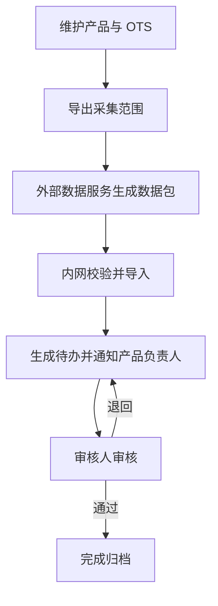

# OTS 信息维护平台需求规格说明

| 文档项 | 内容 |
| --- | --- |
| 文档版本 | V1.6 |
| 文档状态 | V1 需求基线 |
| 编制日期 | 2026-08-15 |
| 建设原则 | 功能简洁、操作明确、易部署、内网运行 |
| 本版调整 | 删除 OTS 情报分析员角色及独立情报分析环节；外部数据成功导入后直接为相关产品版本生成评估待办并通知产品负责人；保留其他产品已审核评估结论的参考能力；外网采集为项目边界外的外部数据服务；数据库升级使用编号化 MySQL SQL 脚本 |

## 1. 文档目的

本文档明确 OTS 信息维护平台 V1 的建设范围、角色、业务流程、功能要求、非功能要求和验收标准，作为产品原型、开发、测试和验收依据。

平台部署于组织内网。V1 以完成“情报采集、离线导入、产品评估、审核归档”闭环为目标，不建设复杂安全体系、实时同步平台或微服务基础设施。

## 2. 建设目标

1. 统一维护产品、产品版本、OTS 组件及产品版本与 OTS 的关联，并为每个产品版本指定产品负责人和审核人；
2. 管理平台根据实际在用 OTS 生成最小采集范围，并接收外部数据服务按该范围提供的相关漏洞、KEV 和 EOL 离线数据包；
3. 外部数据成功导入后，直接为使用相关 OTS 的不同产品版本生成独立评估任务，由产品负责人开展适用性、影响和处置评估；
4. 保存来源提供的 CVSS v3.1 信息，并支持 CVSS v3.1 产品环境评分；
5. 支持评估提交、审核通过、退回修改和重新提交；
6. 支持查询、导出、历史追溯、数据库数据变更记录和数据备份；
7. 控制页面数量、操作步骤和部署组件数量，降低使用与维护成本。

## 3. 项目约束

| 项目 | V1 约束 |
| --- | --- |
| 产品规模 | 不超过 200 个 |
| OTS 规模 | 不超过 200 个 |
| 产品版本 | 每个产品不超过 3 个版本 |
| 并发用户 | 支持 10～20 个在线用户 |
| 数据保留 | 业务数据、历史版本和数据库变更记录保留 10 年 |
| 管理平台网络 | 部署于内网，不直接访问互联网 |
| 正式数据库 | V1 仅支持 MySQL，不同时兼容多种数据库 |
| 数据采集 | 由项目边界外的独立外部数据服务完成；本项目只导出范围并接收符合契约的数据包 |
| 数据交换 | 通过一个 ZIP 数据包离线交换；数据包内使用多张版本化 CSV |
| 采集范围 | 默认仅包含已关联到启用产品及启用产品版本的 OTS，并按 OTS 去重；不得向管理平台批量回传与范围内 OTS 无关的漏洞数据 |
| 用户认证 | 使用本地账号，不接 LDAP、AD、OIDC 或 SSO |
| 产品授权 | 可按整个产品或指定产品版本授权 |
| 人员分配 | 每个产品版本指定一个当前产品负责人和一个当前审核人；OTS 不再指定情报分析员 |
| 评估审核 | 审核通过即完成，不设置独立批准人 |
| 职责分离 | 同一条评估的提交人不能审核自己的记录 |
| EOL 确认 | 导入信息由审核人确认；不设置固定复核周期 |
| 风险接受 | 不要求电子签名、独立批准或到期复核 |
| SBOM 格式 | 不支持 SPDX、CycloneDX 导入 |
| 通知 | 外部数据成功导入后，通过站内工作台直接通知产品负责人；V1 不实现邮件通知 |
| AI | 不作为 V1 核心功能或验收项；表 8 仅保存基于公开 CVE 事实生成的漏洞级通用建议，不得使用 OTS 特定信息或产品内部信息 |
| 安全 | 不是建设重点，仅实现账号、权限、数据库变更审计、文件校验和备份等基础控制 |

## 4. 建设范围

### 4.1 V1 必须实现

- 本地用户、固定角色和产品范围授权；
- 产品、产品版本、OTS 及其关联管理，并支持为产品版本指定产品负责人和审核人；
- 基于管理平台实际在用 OTS 的采集范围 CSV 导出；
- 外部数据服务输入的版本化 ZIP/CSV 数据包校验、预览和导入；
- CVE、CWE、受影响版本、参考链接、CVSS v3.1、KEV 和 EOL 信息管理；
- OTS/CVE 候选关联导入、产品适用性评估、环境评分、影响分析和处置建议；
- 审核通过、退回、重新提交和修订留痕；
- 工作台、组合查询、评估表导出、数据库变更记录和数据备份。

### 4.2 非核心增强项

以下功能不属于 V1 验收范围，未实现不影响 V1 交付：

- 邮件通知；
- 基于公开 CVE 事实生成 AI 漏洞级通用分析建议；
- 跨产品评估数据复制；
- 历史 CSV 模板自动映射。

若实现 AI 增强，只能使用已经公开的 CVE 描述、CWE、CVSS、KEV 和参考链接；不得发送 OTS 特定信息、产品名称、产品用途、网络信息、内部证据或其他产品数据。AI 输出保存为漏洞层面的通用建议，必须与来源事实和产品评估明确区分，不能自动形成 OTS 匹配、产品适用性、风险或处置结论。若未来需要结合具体产品生成建议，只能作为该产品评估的辅助草稿保存，不能复用表 8 的单一 CVE 级字段。

### 4.3 V1 不实现

- 管理平台直接联网采集或采集端实时推送；
- 独立批准人、电子签名、风险到期复核；
- 微服务、消息中间件、分布式数据库、对象存储和独立搜索引擎；
- LDAP、AD、OIDC、SSO 和多因素认证；
- SPDX、CycloneDX 等标准 SBOM 文件导入；
- 注册区域管理及按区域配置不同评分或审核流程；
- 自动抓取全部厂商公告；
- 高级趋势大屏、复杂告警升级和独立通知中心。

## 5. 术语与核心对象

| 术语/对象 | 定义 |
| --- | --- |
| OTS | 产品涉及的第三方现成软件组件，包括开源软件、商业闭源组件、固件、驱动、操作系统、容器基础镜像、开发工具等 |
| 产品 OTS | 某个产品版本实际使用或依赖的 OTS 实例 |
| CVE | 通用漏洞唯一标识及其来源事实；CVE ID 唯一标识漏洞本身，不直接表示该漏洞影响哪些 OTS |
| CVE/OTS 候选关联 | 外部数据服务根据其数据来源形成并随数据包导入的候选关系，保存匹配方式和匹配依据；不等同于具体产品受影响结论 |
| CVSS | 漏洞严重性评分；平台保存来源评分并支持产品环境评分 |
| KEV | CISA 已知被利用漏洞目录信息 |
| EOL | OTS 版本线的生命周期终止信息 |
| 产品评估 | 针对某个“产品版本所用 OTS + CVE”作出的适用性、影响和处置判断 |
| 导入批次 | 一次离线数据包的校验、导入、统计和覆盖时间记录 |
| 审核记录 | 审核结论、意见、人员、时间及所审核的评估版本 |

平台使用统一关系数据模型，不为每个产品或每个 OTS 创建独立物理数据表。`CVE ID` 对漏洞主记录唯一，但 CVE 与 OTS 之间采用多对多关系：一个 CVE 可能影响多个采用相同缺陷代码或依赖的 OTS，一个 OTS 也可能存在多个不同 CVE。平台使用独立关联记录表达“哪个 CVE 与哪个 OTS 有关”，避免在漏洞主记录中放置只能容纳一个 OTS 的字段。

## 6. 角色与权限

| 角色 | 主要职责 | 主要权限 |
| --- | --- | --- |
| 系统管理员 | 系统基础数据和账号管理 | 管理用户、固定角色、产品授权、产品/OTS 主数据，为产品版本指定产品负责人和审核人，执行数据导入和全局查询 |
| 产品负责人 | 完成所负责产品版本的漏洞评估 | 接收导入后生成的站内待办，参考来源事实、候选匹配依据和其他产品已审核结论，填写适用性、环境评分、影响、措施和依据，提交审核 |
| 审核人 | 审核所分配产品版本的评估和 EOL 结论 | 查看证据，通过或退回产品评估，确认或不采信 EOL 信息 |

权限规则：

1. 一个用户可以具有多个角色；
2. 产品级授权包含该产品全部有效版本，版本级授权仅包含指定版本；
3. 系统必须阻止用户审核自己提交的同一条评估；
4. 审核人只能通过或退回，不能直接修改提交人的结论；
5. 停用用户后保留其历史记录；
6. 只有产品版本当前指定的产品负责人可以编辑或提交该版本的产品评估；
7. 只有产品版本当前指定的审核人可以审核该版本的待审核记录；若其与提交人相同，必须先重新指定审核人；
8. 人员重新分配只改变当前及后续待办，不改写历史提交人和历史审核人；
9. V1 使用固定角色，不提供自定义权限矩阵。

## 7. 总体业务流程

管理平台先从启用产品、启用产品版本及产品 OTS 关联中生成去重后的采集范围；外部数据服务仅回传与该范围相关的漏洞候选。本项目不实现外部服务的数据源访问或匹配逻辑。自动匹配只生成 OTS/CVE 候选关系，不自动得出产品“受影响”结论。数据包成功导入后，系统立即为每个相关有效产品 OTS 创建或更新独立产品评估任务，并通过站内工作台通知该产品版本当前负责人。产品负责人评估时可以查看相同 OTS/CVE 在其他产品中已审核通过的评估结论，但必须独立确认本产品结论。

## 8. 功能需求

### 8.1 用户与授权

| 编号 | 需求 |
| --- | --- |
| FR-USER-001 | 管理员应能创建、编辑、重置密码、停用和查询本地用户。 |
| FR-USER-002 | 管理员应能为用户分配一个或多个固定角色。 |
| FR-USER-003 | 管理员应能按产品或产品版本为用户授权。 |
| FR-USER-004 | 系统应按角色和产品范围控制查看及操作权限。 |
| FR-USER-005 | 系统应阻止评估提交人审核同一条评估。 |
| FR-USER-006 | 管理员应为每个产品版本指定一个当前产品负责人和一个当前审核人。 |
| FR-USER-007 | 指定人员必须为启用状态且具有相应角色；人员调整不得改写历史提交和审核信息。 |

### 8.2 产品、版本和 OTS

| 编号 | 需求 |
| --- | --- |
| FR-MASTER-001 | 管理员应能新建、编辑、停用和查询产品、产品版本及 OTS。 |
| FR-MASTER-002 | 产品至少包含编号、名称、说明和状态。 |
| FR-MASTER-003 | 产品版本至少包含版本号、说明、当前产品负责人、当前审核人和状态。 |
| FR-MASTER-004 | OTS 的核心业务信息仅包含名称、版本、官方网站和是否 EOL，不再保存情报分析员分配信息。 |
| FR-MASTER-005 | 一个产品版本可关联多个 OTS，同一 OTS 可被多个产品版本使用；关联记录不重复保存 OTS 主数据。 |
| FR-MASTER-006 | 产品 OTS 清单应支持查询、CSV 导入和导出。 |
| FR-MASTER-007 | 产品环境评分统一使用 CVSS v3.1。 |

### 8.3 外部数据输入与离线交换

| 编号 | 需求 |
| --- | --- |
| FR-EXCH-001 | 管理平台应从启用产品 → 启用产品版本 → 产品 OTS 关联生成采集范围，只包含实际在用 OTS，并按 OTS ID 去重。 |
| FR-EXCH-002 | 采集范围 CSV 至少包含范围导出 ID、OTS ID、名称、版本、官方网站和该 OTS 上次成功数据覆盖截止时间。 |
| FR-EXCH-003 | 外部数据服务输入的数据包应提供 CVE、发布时间、最后修改时间、描述、CWE、受影响范围、参考链接和来源 CVSS；本项目只校验、预览和导入这些字段。 |
| FR-EXCH-004 | 外部数据服务输入的数据包可提供 KEV 信息；本项目只校验、预览和导入这些字段。 |
| FR-EXCH-005 | 外部数据服务输入的数据包可提供 EOL 候选信息；本项目只校验、预览和导入这些字段。 |
| FR-EXCH-006 | 外部数据服务应读取采集范围并在生成数据包前完成范围过滤；本项目校验回传包只包含范围内 OTS 的相关数据，不实现数据源调用。 |
| FR-EXCH-007 | 回传数据包只允许包含与范围内 OTS 至少存在一条候选匹配关系的 CVE、对应来源事实、CVSS、CWE、参考、KEV 和 EOL 候选，不得携带无关漏洞全集。 |
| FR-EXCH-008 | 导入前应展示新增、更新、重复、冲突和错误数量，由管理员确认后写入。 |
| FR-EXCH-009 | 同一批次重复导入不得生成重复数据或任务。 |
| FR-EXCH-010 | 外部来源更新应更新漏洞当前来源事实、OTS/CVE 候选匹配信息及内容哈希，但不得覆盖产品评估和审核记录。 |
| FR-EXCH-011 | 人工维护内容发生唯一键冲突时应提示，不得静默覆盖。 |
| FR-EXCH-012 | 导入错误应包含文件名、行号、字段和原因，并支持导出错误清单。 |
| FR-EXCH-013 | 外部数据服务应输出一个版本化 ZIP 数据包，包内包含多张关联 CSV、原采集范围导出 ID、范围文件摘要和批次说明；本项目按该契约接收和校验。 |
| FR-EXCH-014 | 管理平台应校验数据包格式、必填字段、引用关系、批次号、范围导出 ID 和范围文件摘要；OTS/CVE 匹配中的 OTS ID 必须属于对应采集范围。 |
| FR-EXCH-015 | 数据包应按每个 OTS 记录采集成功、失败、未执行及成功覆盖截止时间；单个 OTS 失败不得伪装为成功覆盖。 |
| FR-EXCH-016 | 管理平台新增、停用产品版本或调整产品 OTS 关联后，下一次导出的采集范围应相应增加或移除 OTS；移出范围不得删除其历史漏洞、候选关联或评估数据。 |
| FR-EXCH-017 | 首次采集没有上次覆盖时间时，应使用配置的初始回溯起点；成功完成但没有新增匹配时，只能解释为本次覆盖窗口内没有新的匹配候选，不能解释为该 OTS 没有漏洞。 |

### 8.4 漏洞、CVSS、KEV 和 EOL

| 编号 | 需求 |
| --- | --- |
| FR-VULN-001 | 漏洞至少记录 CVE ID、状态、描述、发布时间、最后修改时间、CWE、参考链接和受影响版本范围。 |
| FR-VULN-002 | 同一 CVE 应保存来源提供的 CVSS v3.1 分数、严重度、向量和评分来源。 |
| FR-VULN-003 | 来源未提供 CVSS v3.1 评分时显示“来源未提供”，不得自动生成或换算评分。 |
| FR-VULN-004 | 系统应保存 KEV 标记、加入日期、要求处置日期和官方处置说明。 |
| FR-VULN-005 | CVE 状态、评分、受影响范围或 KEV 发生实质变化时，应将相关产品评估标记为待复评并通知对应产品负责人。 |
| FR-VULN-006 | CVE ID 应唯一标识漏洞主记录；CVE 与 OTS 的多对多关系应由独立 OTS/CVE 关联记录维护，不在漏洞主记录中保存单一 OTS ID。 |
| FR-VULN-007 | 系统可保存基于公开漏洞事实生成的 AI 通用分析建议；该建议可为空，且必须与来源事实和产品结论明确区分。 |
| FR-EOL-001 | OTS 应保存是否 EOL 的当前采用结论。 |
| FR-EOL-002 | endoflife.date 导入结果作为候选信息在导入确认时展示，确认后才更新 OTS 的 EOL 结论。 |
| FR-EOL-003 | 供应商或项目官方声明优先于聚合来源；没有可靠信息时不得推断为“未 EOL”。 |

### 8.5 OTS/CVE 候选关联与任务生成

| 编号 | 需求 |
| --- | --- |
| FR-MATCH-001 | 外部数据服务应在范围内漏洞数据中提供 OTS/CVE 候选关联、匹配方式、匹配依据和可选置信度；本项目保存并展示该输入，不实现候选匹配算法。 |
| FR-MATCH-002 | 管理平台导入候选关联时应保存其来源批次和匹配依据；候选关联不设置人工分析员确认或提交环节。 |
| FR-MATCH-003 | 数据包成功导入后，系统应为每个相关有效产品 OTS 创建独立产品评估任务，并将当前责任人设置为该产品版本指定的产品负责人。 |
| FR-MATCH-004 | 新建或进入待复评的任务应立即出现在产品负责人站内工作台；V1 不新增独立通知表。 |
| FR-MATCH-005 | 重复导入不得生成重复评估任务；来源发生实质变化时不得覆盖已完成评估，应创建待复评修订。 |
| FR-MATCH-006 | 自动候选关联只用于提醒和提供线索；最终适用性、环境评分、影响和处置结论由各产品负责人独立填写。 |

### 8.6 产品评估

| 编号 | 需求 |
| --- | --- |
| FR-ASSESS-001 | 每个“产品版本 + 产品 OTS + CVE”应具有独立评估记录。 |
| FR-ASSESS-002 | 产品负责人评估时必须能够查看相同 OTS/CVE 的来源描述、CWE、CVSS、KEV、受影响范围、参考链接、候选匹配方式与依据，以及可选 AI 通用建议。 |
| FR-ASSESS-003 | 适用性结论为：受影响、不受影响、部分受影响、待确认。 |
| FR-ASSESS-004 | 选择适用性结论时必须填写依据。 |
| FR-ASSESS-005 | 系统应按产品版本选择的 CVSS 模型展示环境指标，并由后端计算分数和向量。 |
| FR-ASSESS-006 | 产品负责人应填写产品影响、现有控制、处置建议和必要证据。 |
| FR-ASSESS-007 | 处置建议为：升级/补丁、配置缓解、隔离/补偿控制、接受风险、无需处置、进一步调查。 |
| FR-ASSESS-008 | “不受影响”“接受风险”“无需处置”必须填写依据。 |
| FR-ASSESS-009 | 提交后记录进入待审核；已提交版本不得直接覆盖。 |
| FR-ASSESS-010 | 产品评估不单独保存填写人；系统保存当前责任人和实际提交人，草稿数据变化通过数据库变更记录追溯。 |
| FR-ASSESS-011 | 产品负责人应能查看相同 OTS/CVE 在其他产品中当前且已审核通过的评估摘要；不得查看其他产品草稿、内部证据或审核意见，也不得将参考结论自动作为本产品结论。 |
| FR-ASSESS-012 | 产品负责人应填写本产品的分析摘要、触发条件、涉及功能或接口，并结合产品上下文完成适用性、影响、控制和处置评估。 |

### 8.7 审核与修订

| 编号 | 需求 |
| --- | --- |
| FR-REVIEW-001 | 产品版本当前指定审核人应能在同一页面查看来源事实、候选匹配依据、其他产品已审核结论、环境评分、本产品结论、措施和依据。 |
| FR-REVIEW-002 | 审核操作为“通过”或“退回”；退回必须填写意见。 |
| FR-REVIEW-003 | 审核通过后进入已完成，不再设置批准步骤。 |
| FR-REVIEW-004 | 已完成记录发生修改时，应创建新修订并重新审核。 |
| FR-REVIEW-005 | 系统应记录审核人、审核时间、结论和所审核版本。 |
| FR-REVIEW-006 | 待审核任务按产品版本当前指定审核人分配；实际完成审核后，应在评估修订中保存实际审核人。 |

### 8.8 工作台、查询、导出和日志

| 编号 | 需求 |
| --- | --- |
| FR-WORK-001 | 首页应展示当前用户的待产品评估、待复评、已退回、待审核和待确认 EOL。 |
| FR-WORK-002 | 管理员应能查看最近导入结果、失败批次和数据覆盖截止时间。 |
| FR-WORK-003 | 系统应支持按 CVE、OTS、产品、严重度、KEV、状态和时间查询。 |
| FR-WORK-004 | 系统应支持从 CVE 追溯到 OTS、产品评估、审核记录和导入批次。 |
| FR-EXPORT-001 | 系统应导出指定产品版本、指定 OTS 的完整评估表。 |
| FR-EXPORT-002 | 导出内容至少包含 CVE、来源评分、环境评分、向量、分析依据、处置建议和审核信息。 |
| FR-AUDIT-001 | 系统只在核心业务数据成功写入数据库时记录变更，动作类型限定为新增、更新、删除和批量写入。 |
| FR-AUDIT-002 | 数据变更记录至少包含操作者、时间、对象、对象 ID、动作及关键字段变化；不要求保存客户端地址或恒定的成功结果。 |
| FR-AUDIT-003 | 登录、纯查询、导出、备份执行和事务失败回滚不写入数据库变更表；如需登录安全追踪，应使用独立应用安全日志。 |

## 9. 产品评估状态设计

| 状态 | 含义 |
| --- | --- |
| 待评估 | 已生成产品任务，尚未提交 |
| 待审核 | 产品负责人已提交 |
| 已退回 | 审核人退回，等待修改 |
| 已完成 | 审核通过 |
| 待复评 | 来源事实、候选匹配或产品 OTS 关联发生实质变化 |

OTS/CVE 候选关联不设置人工流程状态。各产品评估状态独立保存，不使用一个聚合状态覆盖不同产品的进度。

## 10. 关键业务规则

1. CVE ID 唯一标识漏洞主记录，CVE 通用事实与产品特定评估分开保存；
2. CVE 与 OTS 是多对多关系：一个 CVE 可关联多个 OTS，一个 OTS 可关联多个 CVE；外部候选匹配及依据保存在独立关联记录中；
3. 产品环境评分统一使用 CVSS v3.1；来源未提供该评分时不得自动生成或换算；
4. EOL 属于 OTS 版本线，不属于单个 CVE；
5. 最近导入时间、数据覆盖截止时间和最后完成评估时间分别记录；
6. 自动匹配只生成候选关系，不自动生成“受影响”结论；
7. 数据源没有返回记录时，不得解释为“无漏洞”或“未 EOL”；
8. 来源更新修改漏洞当前来源事实和候选匹配信息，并通过内容哈希识别实质变化，但不得覆盖产品评估或审核结论；
9. 已完成评估在相关事实变化后进入待复评，原版本继续可查；
10. 产品评估必须关联相同 OTS/CVE 的候选匹配记录，并可参考其他产品当前且已审核通过的结论；本产品的适用性、环境评分和处置结论必须独立保存；
11. 产品版本当前产品负责人用于评估待办分配，当前审核人用于审核待办分配；实际提交人和实际审核人用于历史留痕；
12. AI 建议只能作为通用辅助信息，不能代替来源事实、候选匹配依据或产品结论；
13. 采集范围以管理平台当前实际在用 OTS 为准，同一 OTS 被多个产品版本使用时只导出一次；
14. 外网工具可以为完成匹配而临时读取较大来源集合，但回传包必须在外网侧过滤，只保留范围内 OTS 的相关数据；
15. 每个 OTS 的覆盖截止时间独立维护，只有该 OTS 采集成功时才能推进；
16. OTS 从采集范围移除只停止后续采集，不删除已经导入的来源事实、候选关联和产品评估；
17. 其他产品评估仅展示已审核通过的当前修订摘要，不展示草稿、内部证据和审核意见，参考行为不得改变当前产品任务状态。

## 11. 页面与易用性要求

V1 一级导航固定为 6 个：工作台、产品、OTS、漏洞评估、数据交换、系统管理。

- 首页优先展示当前用户待办，不建设复杂图表大屏；
- 新建产品使用“产品基本信息 → 产品版本 → OTS 清单”三步流程；
- 产品评估和审核使用同一详情页；
- 产品版本表单应指定产品负责人和审核人，OTS 表单只维护名称、版本、官方网站和是否 EOL；
- 产品评估详情应分区展示来源事实、候选匹配依据、AI 通用建议、其他产品已审核结论和当前产品结论；
- 数据导入固定为“上传 → 校验预览 → 确认导入 → 查看结果”；
- 列表支持关键词、状态和产品筛选，并提供明确的空状态和错误提示；
- 被退回或待补充任务在页面顶部展示原因；
- 删除、提交和审核等关键操作应二次确认。

## 12. 非功能需求

### 12.1 易部署与维护

- 管理平台采用单机部署，不要求 Kubernetes；
- 运行组件仅包含应用和 MySQL，不依赖 Redis、RabbitMQ、Elasticsearch 或对象存储；
- 提供 Docker Compose 一键部署，同时提供应用服务加 MySQL 的普通部署方式；
- 配置集中在单个配置文件或环境变量文件；
- 初次采集回溯起点作为导出范围字段由配置文件统一设置；外部数据服务如何使用该字段不属于本项目；
- 提供初始化、升级、备份和恢复脚本；
- 数据库结构升级使用独立于后端应用的编号化 MySQL SQL 脚本；不创建额外迁移基础表。

### 12.2 性能与容量

- 支持 200 个产品、200 个 OTS、每个产品最多 3 个版本；
- 支持 10～20 个并发在线用户；
- 正常数据量下，常用列表和详情页 95% 请求在 3 秒内返回；
- 10,000 行以内 CSV 数据包在 5 分钟内完成校验和导入；
- 业务数据、历史版本和数据库变更记录保留 10 年。

### 12.3 可靠性与基础控制

- 导入以批次为单位，失败时不得产生不可识别的半导入状态；
- 批次号和业务唯一键应防止重复导入；
- 数据库每日备份，每年至少执行一次恢复验证；
- 本地账号密码不得明文保存；
- 服务端校验角色、产品范围和禁止自审规则；
- 用户、产品、产品版本、OTS 和产品评估等可编辑记录应使用乐观锁，发现并发覆盖时提示刷新后重试；
- 管理平台不得主动访问互联网；
- 上传文件仅允许平台定义的 CSV/ZIP，并限制文件大小和字段长度；
- 普通用户不能修改审核历史和数据库变更记录。

## 13. V1 验收标准

1. 管理员能够管理本地用户、固定角色及产品/产品版本授权，并为每个产品版本指定产品负责人和审核人；
2. 管理员能够管理产品、版本、OTS 以及产品版本与 OTS 的关联；
3. 管理平台能够导出采集范围，并校验、预览和导入外部数据服务提供的版本化 ZIP/CSV 数据包；
4. 采集范围只包含关联到启用产品和启用产品版本的 OTS，同一 OTS 被多个产品版本使用时只出现一次；
5. 管理平台新增或移除产品 OTS 关联后，下一次采集范围能够相应变化且不删除历史数据；
6. 回传数据包不包含与采集范围无候选匹配关系的 CVE，管理平台能够拒绝范围外 OTS 关联；
7. 管理平台能够校验、预览并导入数据包，重复导入不产生重复数据；
8. 每个 OTS 的采集结果和覆盖截止时间能够独立记录，失败 OTS 不推进覆盖时间；
9. 平台能够保存并区分 CVE、CWE、受影响范围、参考链接、CVSS v3.1、KEV 和 EOL；
10. EOL 候选信息能够由审核人确认或不采信；
11. 数据包成功导入后，能够为使用相关 OTS 的多个有效产品版本直接生成相互独立的评估任务，并在对应产品负责人工作台显示；
12. 重复导入不生成重复待办，来源实质变化能够生成待复评修订且不覆盖已完成结论；
13. 产品负责人评估时能够查看来源事实、候选匹配依据、可选 AI 建议和其他产品已审核结论，并填写本产品适用性、环境评分、依据和处置建议后提交审核；
14. 产品版本当前指定审核人能够通过或退回，系统能够阻止提交人自审；
15. 已提交和已完成记录不能被普通导入或编辑直接覆盖；
16. 关键来源事实变化后，相关记录能够进入待复核或待复评；
17. 用户能够查询并导出指定产品版本和 OTS 的完整评估表；
18. 首页能够展示当前用户待办、最近导入时间和数据覆盖截止时间；
19. 成功提交的数据库新增、更新、删除和批量写入可查询，数据库可按交付脚本完成备份和恢复；
20. 10～20 个并发用户下，常用页面满足响应时间要求；
21. 未配置邮件或 AI 服务时，完整人工流程仍可使用。

## 14. 参考数据源与标准

- [NVD CVE API 2.0](https://nvd.nist.gov/developers/vulnerabilities)
- [NVD API Workflows](https://nvd.nist.gov/developers/api-workflows)
- [CISA Known Exploited Vulnerabilities Catalog](https://www.cisa.gov/known-exploited-vulnerabilities-catalog)
- [FIRST CVSS v3.1 Specification](https://www.first.org/cvss/v3.1/specification-document)
- [endoflife.date API v1](https://endoflife.date/docs/api/v1/)
